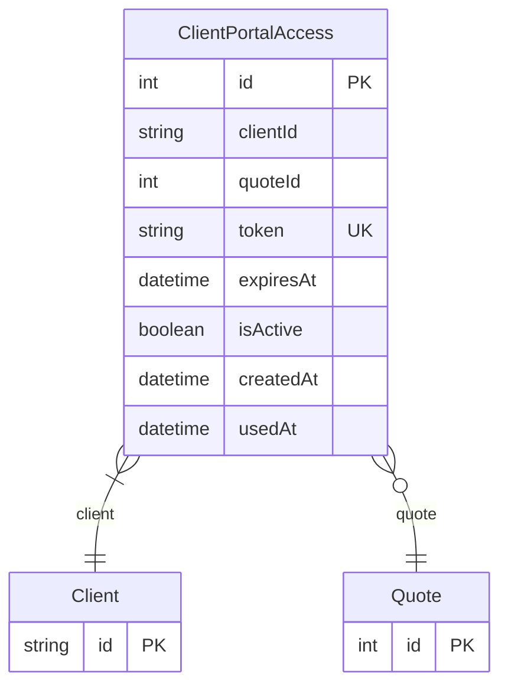

# ClientPortalAccess

> Table name: `client_portal_access`

**Schema location:** Lines 8820-8837

## Fields

| Field | Type | Required | Unique | Default | Notes |
|-------|------|----------|--------|---------|-------|
| `id` | `Int` | ✅ | 🔑 PK | `autoincrement(` |  |
| `clientId` | `String` | ✅ |  | `` |  |
| `quoteId` | `Int?` | ❌ |  | `` |  |
| `token` | `String` | ✅ | ✅ | `` | DB: VarChar(100) |
| `expiresAt` | `DateTime` | ✅ |  | `` |  |
| `isActive` | `Boolean` | ✅ |  | `true` |  |
| `createdAt` | `DateTime` | ✅ |  | `now(` |  |
| `usedAt` | `DateTime?` | ❌ |  | `` |  |

## Relations

| Field | Type | Cardinality | FK Fields | References | On Delete |
|-------|------|-------------|-----------|------------|-----------|
| `client` | [Client](./models/Client.md) | Many-to-One | clientId | id | Cascade |
| `quote` | [Quote](./models/Quote.md) | Many-to-One (optional) | quoteId | id | - |

## Referenced By

| Model | Field | Cardinality |
|-------|-------|-------------|
| [Client](./models/Client.md) | `portalAccess` | Has many |
| [Quote](./models/Quote.md) | `portalAccess` | Has many |

## Indexes

- `token`
- `clientId`
- `expiresAt`

## Entity Diagram

