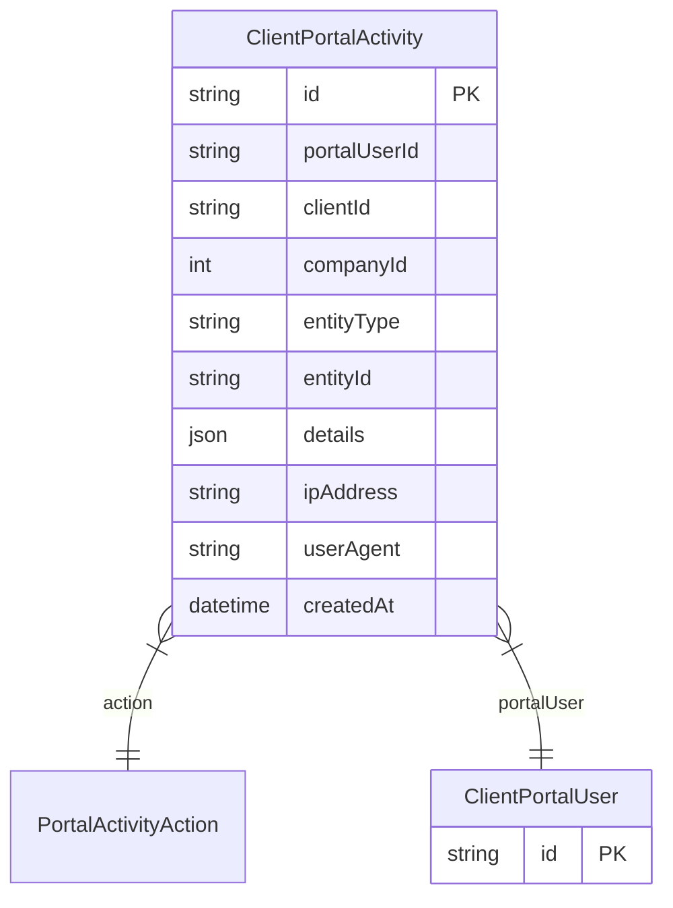

# ClientPortalActivity

> Table name: `client_portal_activity`

**Schema location:** Lines 9093-9123

## Fields

| Field | Type | Required | Unique | Default | Notes |
|-------|------|----------|--------|---------|-------|
| `id` | `String` | ✅ | 🔑 PK | `cuid(` |  |
| `portalUserId` | `String` | ✅ |  | `` |  |
| `clientId` | `String` | ✅ |  | `` |  |
| `companyId` | `Int` | ✅ |  | `` |  |
| `entityType` | `String?` | ❌ |  | `` | DB: VarChar(50). Entidad relacionada |
| `entityId` | `String?` | ❌ |  | `` |  |
| `details` | `Json?` | ❌ |  | `` | Detalles adicionales |
| `ipAddress` | `String?` | ❌ |  | `` | DB: VarChar(50). Tracking |
| `userAgent` | `String?` | ❌ |  | `` |  |
| `createdAt` | `DateTime` | ✅ |  | `now(` |  |

## Relations

| Field | Type | Cardinality | FK Fields | References | On Delete |
|-------|------|-------------|-----------|------------|-----------|
| `action` | [PortalActivityAction](./models/PortalActivityAction.md) | Many-to-One | - | - | - |
| `portalUser` | [ClientPortalUser](./models/ClientPortalUser.md) | Many-to-One | portalUserId | id | - |

## Referenced By

| Model | Field | Cardinality |
|-------|-------|-------------|
| [ClientPortalUser](./models/ClientPortalUser.md) | `activities` | Has many |

## Indexes

- `portalUserId`
- `clientId`
- `companyId`
- `action`
- `createdAt`

## Entity Diagram

