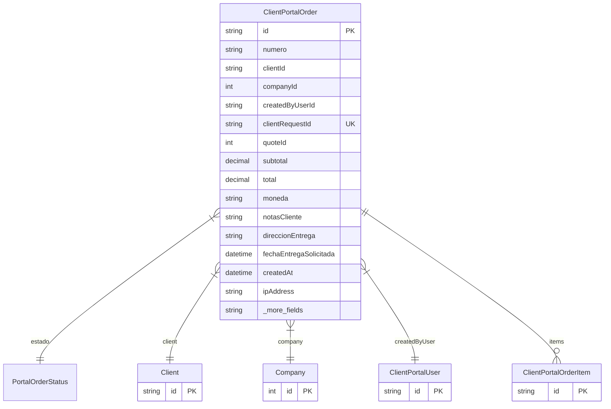

# ClientPortalOrder

> Table name: `client_portal_orders`

**Schema location:** Lines 9015-9070

## Fields

| Field | Type | Required | Unique | Default | Notes |
|-------|------|----------|--------|---------|-------|
| `id` | `String` | ✅ | 🔑 PK | `cuid(` |  |
| `numero` | `String` | ✅ |  | `` | DB: VarChar(50) |
| `clientId` | `String` | ✅ |  | `` |  |
| `companyId` | `Int` | ✅ |  | `` |  |
| `createdByUserId` | `String` | ✅ |  | `` |  |
| `clientRequestId` | `String` | ✅ | ✅ | `` | DB: VarChar(100). Anti-duplicados |
| `quoteId` | `Int?` | ❌ |  | `` | Referencia a cotización |
| `subtotal` | `Decimal` | ✅ |  | `` | DB: Decimal(15, 2). Datos del pedido |
| `total` | `Decimal` | ✅ |  | `` | DB: Decimal(15, 2) |
| `moneda` | `String` | ✅ |  | `"ARS"` | DB: VarChar(10) |
| `notasCliente` | `String?` | ❌ |  | `` | Notas |
| `direccionEntrega` | `String?` | ❌ |  | `` | Datos de entrega |
| `fechaEntregaSolicitada` | `DateTime?` | ❌ |  | `` |  |
| `createdAt` | `DateTime` | ✅ |  | `now(` | Tracking |
| `ipAddress` | `String?` | ❌ |  | `` | DB: VarChar(50) |
| `userAgent` | `String?` | ❌ |  | `` |  |
| `processedAt` | `DateTime?` | ❌ |  | `` | Procesamiento |
| `processedBy` | `Int?` | ❌ |  | `` |  |
| `processNotes` | `String?` | ❌ |  | `` |  |
| `rejectionReason` | `String?` | ❌ |  | `` |  |
| `convertedToQuoteId` | `Int?` | ❌ |  | `` | Conversión |
| `convertedToSaleId` | `Int?` | ❌ |  | `` |  |
| `convertedAt` | `DateTime?` | ❌ |  | `` |  |

## Relations

| Field | Type | Cardinality | FK Fields | References | On Delete |
|-------|------|-------------|-----------|------------|-----------|
| `estado` | [PortalOrderStatus](./models/PortalOrderStatus.md) | Many-to-One | - | - | - |
| `client` | [Client](./models/Client.md) | Many-to-One | clientId | id | - |
| `company` | [Company](./models/Company.md) | Many-to-One | companyId | id | - |
| `createdByUser` | [ClientPortalUser](./models/ClientPortalUser.md) | Many-to-One | createdByUserId | id | - |
| `items` | [ClientPortalOrderItem](./models/ClientPortalOrderItem.md) | One-to-Many | - | - | - |

## Referenced By

| Model | Field | Cardinality |
|-------|-------|-------------|
| [Company](./models/Company.md) | `clientPortalOrders` | Has many |
| [Client](./models/Client.md) | `portalOrders` | Has many |
| [ClientPortalUser](./models/ClientPortalUser.md) | `orders` | Has many |
| [ClientPortalOrderItem](./models/ClientPortalOrderItem.md) | `order` | Has one |

## Indexes

- `companyId`
- `clientId`
- `estado`
- `createdAt`

## Entity Diagram

