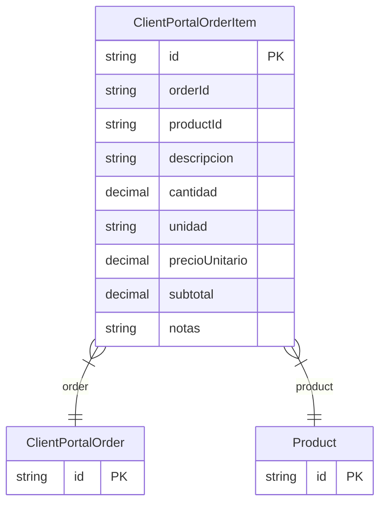

# ClientPortalOrderItem

> Table name: `client_portal_order_items`

**Schema location:** Lines 9073-9090

## Fields

| Field | Type | Required | Unique | Default | Notes |
|-------|------|----------|--------|---------|-------|
| `id` | `String` | ✅ | 🔑 PK | `cuid(` |  |
| `orderId` | `String` | ✅ |  | `` |  |
| `productId` | `String` | ✅ |  | `` |  |
| `descripcion` | `String` | ✅ |  | `` | DB: VarChar(500) |
| `cantidad` | `Decimal` | ✅ |  | `` | DB: Decimal(15, 4) |
| `unidad` | `String` | ✅ |  | `` | DB: VarChar(50) |
| `precioUnitario` | `Decimal` | ✅ |  | `` | DB: Decimal(15, 2) |
| `subtotal` | `Decimal` | ✅ |  | `` | DB: Decimal(15, 2) |
| `notas` | `String?` | ❌ |  | `` |  |

## Relations

| Field | Type | Cardinality | FK Fields | References | On Delete |
|-------|------|-------------|-----------|------------|-----------|
| `order` | [ClientPortalOrder](./models/ClientPortalOrder.md) | Many-to-One | orderId | id | Cascade |
| `product` | [Product](./models/Product.md) | Many-to-One | productId | id | - |

## Referenced By

| Model | Field | Cardinality |
|-------|-------|-------------|
| [Product](./models/Product.md) | `portalOrderItems` | Has many |
| [ClientPortalOrder](./models/ClientPortalOrder.md) | `items` | Has many |

## Indexes

- `orderId`

## Entity Diagram

