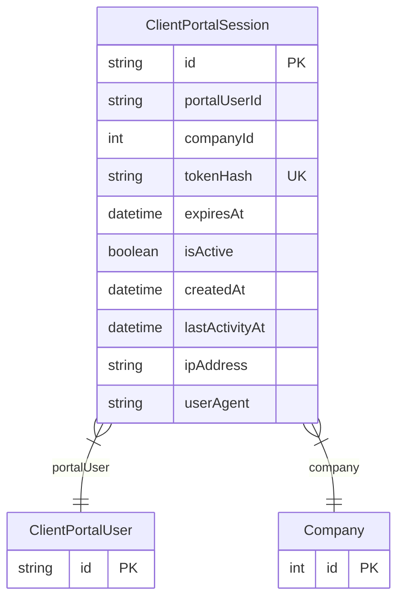

# ClientPortalSession

> Table name: `client_portal_sessions`

**Schema location:** Lines 8986-9012

## Fields

| Field | Type | Required | Unique | Default | Notes |
|-------|------|----------|--------|---------|-------|
| `id` | `String` | ✅ | 🔑 PK | `cuid(` |  |
| `portalUserId` | `String` | ✅ |  | `` |  |
| `companyId` | `Int` | ✅ |  | `` |  |
| `tokenHash` | `String` | ✅ | ✅ | `` | DB: VarChar(255). Token de sesión (hash) |
| `expiresAt` | `DateTime` | ✅ |  | `` | Vigencia |
| `isActive` | `Boolean` | ✅ |  | `true` |  |
| `createdAt` | `DateTime` | ✅ |  | `now(` | Tracking |
| `lastActivityAt` | `DateTime` | ✅ |  | `now(` |  |
| `ipAddress` | `String?` | ❌ |  | `` | DB: VarChar(50) |
| `userAgent` | `String?` | ❌ |  | `` |  |

## Relations

| Field | Type | Cardinality | FK Fields | References | On Delete |
|-------|------|-------------|-----------|------------|-----------|
| `portalUser` | [ClientPortalUser](./models/ClientPortalUser.md) | Many-to-One | portalUserId | id | Cascade |
| `company` | [Company](./models/Company.md) | Many-to-One | companyId | id | - |

## Referenced By

| Model | Field | Cardinality |
|-------|-------|-------------|
| [Company](./models/Company.md) | `clientPortalSessions` | Has many |
| [ClientPortalUser](./models/ClientPortalUser.md) | `sessions` | Has many |

## Indexes

- `tokenHash`
- `portalUserId`
- `expiresAt`

## Entity Diagram

