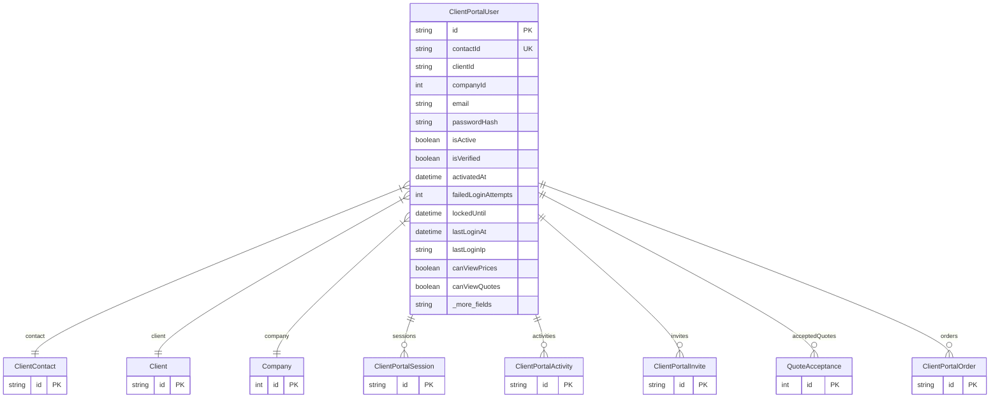

# ClientPortalUser

> Table name: `client_portal_users`

**Schema location:** Lines 8904-8957

## Fields

| Field | Type | Required | Unique | Default | Notes |
|-------|------|----------|--------|---------|-------|
| `id` | `String` | ✅ | 🔑 PK | `cuid(` |  |
| `contactId` | `String` | ✅ | ✅ | `` |  |
| `clientId` | `String` | ✅ |  | `` |  |
| `companyId` | `Int` | ✅ |  | `` |  |
| `email` | `String` | ✅ |  | `` | DB: VarChar(255). Credenciales |
| `passwordHash` | `String` | ✅ |  | `` | DB: VarChar(255) |
| `isActive` | `Boolean` | ✅ |  | `true` | Estado de la cuenta |
| `isVerified` | `Boolean` | ✅ |  | `false` |  |
| `activatedAt` | `DateTime?` | ❌ |  | `` |  |
| `failedLoginAttempts` | `Int` | ✅ |  | `0` | Seguridad |
| `lockedUntil` | `DateTime?` | ❌ |  | `` |  |
| `lastLoginAt` | `DateTime?` | ❌ |  | `` |  |
| `lastLoginIp` | `String?` | ❌ |  | `` | DB: VarChar(50) |
| `canViewPrices` | `Boolean` | ✅ |  | `true` | Permisos |
| `canViewQuotes` | `Boolean` | ✅ |  | `true` |  |
| `canAcceptQuotes` | `Boolean` | ✅ |  | `true` |  |
| `canCreateOrders` | `Boolean` | ✅ |  | `true` |  |
| `canViewHistory` | `Boolean` | ✅ |  | `true` |  |
| `canViewDocuments` | `Boolean` | ✅ |  | `true` |  |
| `maxOrderAmount` | `Decimal?` | ❌ |  | `` | DB: Decimal(15, 2). Límites |
| `requiresApprovalAbove` | `Decimal?` | ❌ |  | `` | DB: Decimal(15, 2) |
| `createdAt` | `DateTime` | ✅ |  | `now(` | Metadata |
| `updatedAt` | `DateTime` | ✅ |  | `` |  |
| `createdBy` | `Int?` | ❌ |  | `` |  |

## Relations

| Field | Type | Cardinality | FK Fields | References | On Delete |
|-------|------|-------------|-----------|------------|-----------|
| `contact` | [ClientContact](./models/ClientContact.md) | Many-to-One | contactId | id | Cascade |
| `client` | [Client](./models/Client.md) | Many-to-One | clientId | id | - |
| `company` | [Company](./models/Company.md) | Many-to-One | companyId | id | - |
| `sessions` | [ClientPortalSession](./models/ClientPortalSession.md) | One-to-Many | - | - | - |
| `activities` | [ClientPortalActivity](./models/ClientPortalActivity.md) | One-to-Many | - | - | - |
| `invites` | [ClientPortalInvite](./models/ClientPortalInvite.md) | One-to-Many | - | - | - |
| `acceptedQuotes` | [QuoteAcceptance](./models/QuoteAcceptance.md) | One-to-Many | - | - | - |
| `orders` | [ClientPortalOrder](./models/ClientPortalOrder.md) | One-to-Many | - | - | - |

## Referenced By

| Model | Field | Cardinality |
|-------|-------|-------------|
| [Company](./models/Company.md) | `clientPortalUsers` | Has many |
| [Client](./models/Client.md) | `portalUsers` | Has many |
| [ClientContact](./models/ClientContact.md) | `portalUser` | Has one |
| [ClientPortalInvite](./models/ClientPortalInvite.md) | `portalUser` | Has one |
| [ClientPortalSession](./models/ClientPortalSession.md) | `portalUser` | Has one |
| [ClientPortalOrder](./models/ClientPortalOrder.md) | `createdByUser` | Has one |
| [ClientPortalActivity](./models/ClientPortalActivity.md) | `portalUser` | Has one |
| [QuoteAcceptance](./models/QuoteAcceptance.md) | `acceptedByUser` | Has one |

## Indexes

- `clientId`
- `companyId`
- `email`

## Unique Constraints

- `companyId, email`

## Entity Diagram

