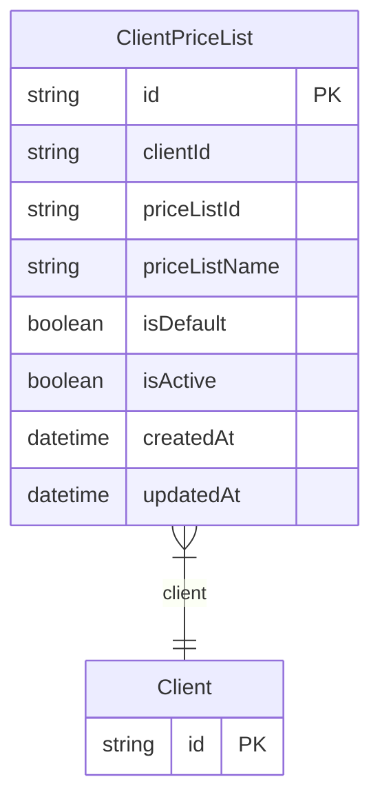

# ClientPriceList

> Table name: `ClientPriceList`

**Schema location:** Lines 4473-4487

## Fields

| Field | Type | Required | Unique | Default | Notes |
|-------|------|----------|--------|---------|-------|
| `id` | `String` | ✅ | 🔑 PK | `cuid(` |  |
| `clientId` | `String` | ✅ |  | `` |  |
| `priceListId` | `String` | ✅ |  | `` |  |
| `priceListName` | `String` | ✅ |  | `` |  |
| `isDefault` | `Boolean` | ✅ |  | `false` |  |
| `isActive` | `Boolean` | ✅ |  | `true` |  |
| `createdAt` | `DateTime` | ✅ |  | `now(` |  |
| `updatedAt` | `DateTime` | ✅ |  | `` |  |

## Relations

| Field | Type | Cardinality | FK Fields | References | On Delete |
|-------|------|-------------|-----------|------------|-----------|
| `client` | [Client](./models/Client.md) | Many-to-One | clientId | id | Cascade |

## Referenced By

| Model | Field | Cardinality |
|-------|-------|-------------|
| [Client](./models/Client.md) | `priceLists` | Has many |

## Indexes

- `clientId`
- `isActive`

## Entity Diagram

