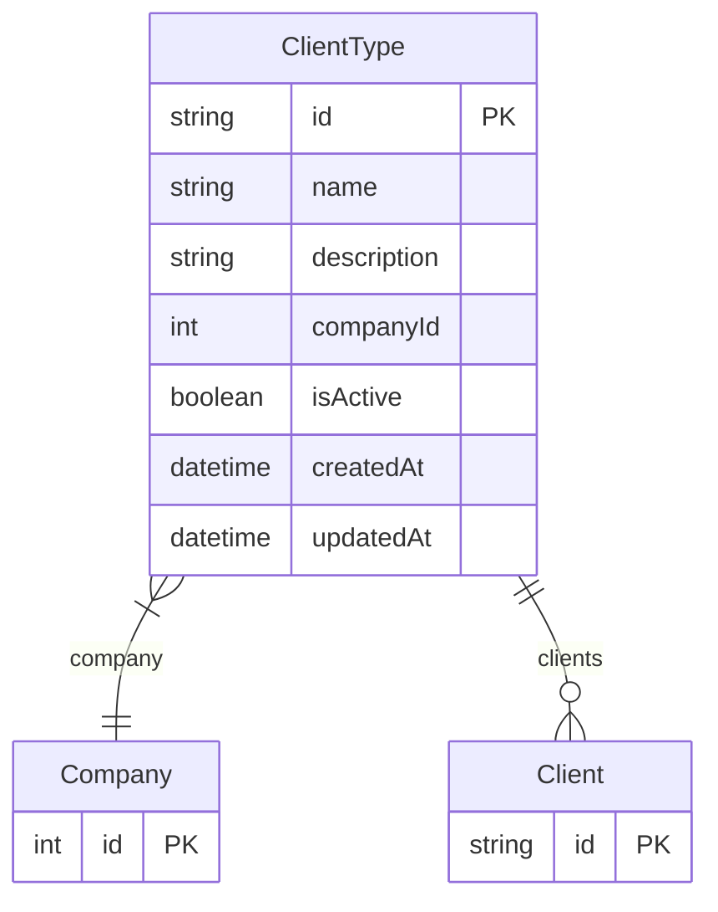

# ClientType

> Table name: `ClientType`

**Schema location:** Lines 4159-4173

## Fields

| Field | Type | Required | Unique | Default | Notes |
|-------|------|----------|--------|---------|-------|
| `id` | `String` | ✅ | 🔑 PK | `cuid(` |  |
| `name` | `String` | ✅ |  | `` |  |
| `description` | `String?` | ❌ |  | `` |  |
| `companyId` | `Int` | ✅ |  | `` |  |
| `isActive` | `Boolean` | ✅ |  | `true` |  |
| `createdAt` | `DateTime` | ✅ |  | `now(` |  |
| `updatedAt` | `DateTime` | ✅ |  | `` |  |

## Relations

| Field | Type | Cardinality | FK Fields | References | On Delete |
|-------|------|-------------|-----------|------------|-----------|
| `company` | [Company](./models/Company.md) | Many-to-One | companyId | id | Cascade |
| `clients` | [Client](./models/Client.md) | One-to-Many | - | - | - |

## Referenced By

| Model | Field | Cardinality |
|-------|-------|-------------|
| [Company](./models/Company.md) | `clientTypes` | Has many |
| [Client](./models/Client.md) | `clientType` | Has one |

## Indexes

- `companyId`

## Unique Constraints

- `companyId, name`

## Entity Diagram

