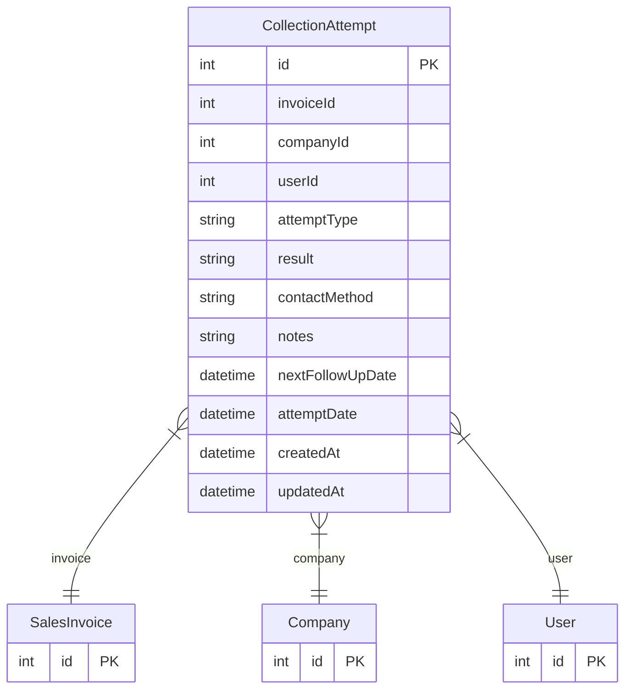

# CollectionAttempt

> Table name: `collection_attempts`

**Schema location:** Lines 9909-9940

## Fields

| Field | Type | Required | Unique | Default | Notes |
|-------|------|----------|--------|---------|-------|
| `id` | `Int` | ✅ | 🔑 PK | `autoincrement(` |  |
| `invoiceId` | `Int` | ✅ |  | `` |  |
| `companyId` | `Int` | ✅ |  | `` |  |
| `userId` | `Int` | ✅ |  | `` |  |
| `attemptType` | `String` | ✅ |  | `` | DB: VarChar(50). 'EMAIL', 'PHONE', 'VISIT', 'LETTER', 'WHATSAPP', 'SMS' |
| `result` | `String` | ✅ |  | `` | DB: VarChar(50). 'CONTACTADO', 'NO_RESPUESTA', 'COMPROMISO_PAGO', 'RECHAZADO', 'PAGO_PARCIAL', 'PAGO_TOTAL' |
| `contactMethod` | `String?` | ❌ |  | `` | DB: VarChar(100) |
| `notes` | `String?` | ❌ |  | `` |  |
| `nextFollowUpDate` | `DateTime?` | ❌ |  | `` | DB: Date. Follow-up |
| `attemptDate` | `DateTime` | ✅ |  | `now(` | Timestamps |
| `createdAt` | `DateTime` | ✅ |  | `now(` |  |
| `updatedAt` | `DateTime` | ✅ |  | `` |  |

## Relations

| Field | Type | Cardinality | FK Fields | References | On Delete |
|-------|------|-------------|-----------|------------|-----------|
| `invoice` | [SalesInvoice](./models/SalesInvoice.md) | Many-to-One | invoiceId | id | Cascade |
| `company` | [Company](./models/Company.md) | Many-to-One | companyId | id | Cascade |
| `user` | [User](./models/User.md) | Many-to-One | userId | id | - |

## Referenced By

| Model | Field | Cardinality |
|-------|-------|-------------|
| [Company](./models/Company.md) | `collectionAttempts` | Has many |
| [User](./models/User.md) | `collectionAttempts` | Has many |
| [SalesInvoice](./models/SalesInvoice.md) | `collectionAttempts` | Has many |

## Indexes

- `invoiceId`
- `companyId`
- `attemptDate`
- `result`
- `companyId, invoiceId`

## Entity Diagram

