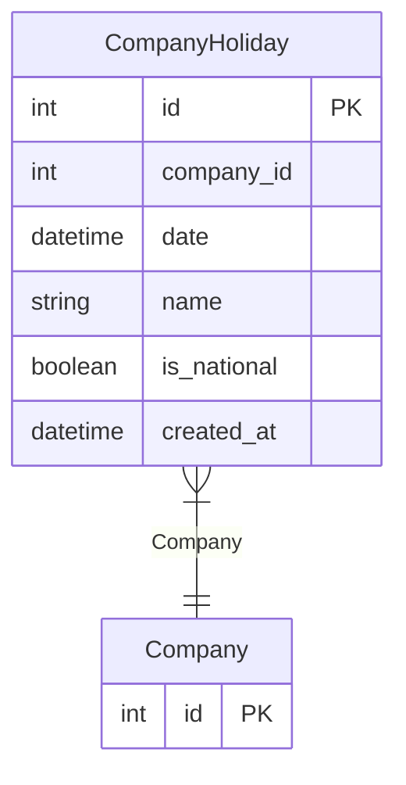

# CompanyHoliday

> Table name: `company_holidays`

**Schema location:** Lines 11646-11659

## Fields

| Field | Type | Required | Unique | Default | Notes |
|-------|------|----------|--------|---------|-------|
| `id` | `Int` | ✅ | 🔑 PK | `autoincrement(` |  |
| `company_id` | `Int` | ✅ |  | `` |  |
| `date` | `DateTime` | ✅ |  | `` | DB: Date |
| `name` | `String` | ✅ |  | `` | DB: VarChar(255) |
| `is_national` | `Boolean` | ✅ |  | `true` |  |
| `created_at` | `DateTime` | ✅ |  | `now(` |  |

## Relations

| Field | Type | Cardinality | FK Fields | References | On Delete |
|-------|------|-------------|-----------|------------|-----------|
| `Company` | [Company](./models/Company.md) | Many-to-One | company_id | id | Cascade |

## Referenced By

| Model | Field | Cardinality |
|-------|-------|-------------|
| [Company](./models/Company.md) | `companyHolidays` | Has many |

## Indexes

- `company_id, date`

## Unique Constraints

- `company_id, date`

## Entity Diagram

