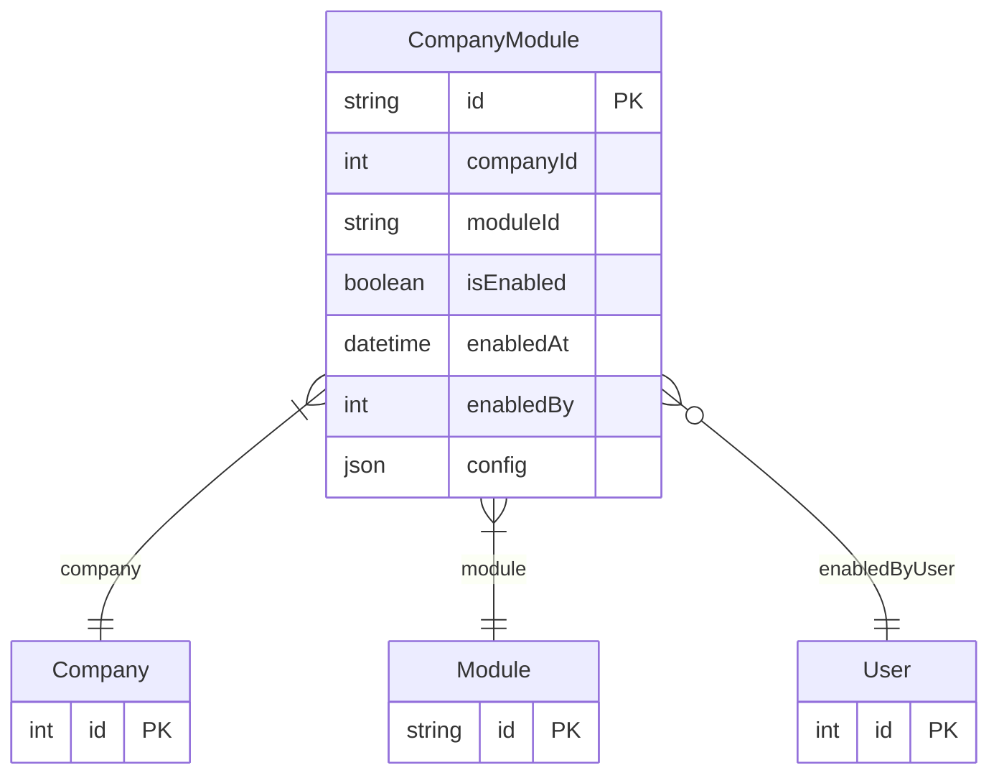

# CompanyModule

> Table name: `company_modules`

**Schema location:** Lines 10429-10447

## Fields

| Field | Type | Required | Unique | Default | Notes |
|-------|------|----------|--------|---------|-------|
| `id` | `String` | ✅ | 🔑 PK | `cuid(` |  |
| `companyId` | `Int` | ✅ |  | `` |  |
| `moduleId` | `String` | ✅ |  | `` |  |
| `isEnabled` | `Boolean` | ✅ |  | `true` |  |
| `enabledAt` | `DateTime` | ✅ |  | `now(` |  |
| `enabledBy` | `Int?` | ❌ |  | `` |  |
| `config` | `Json?` | ❌ |  | `` | Configuración específica del módulo por empresa |

## Relations

| Field | Type | Cardinality | FK Fields | References | On Delete |
|-------|------|-------------|-----------|------------|-----------|
| `company` | [Company](./models/Company.md) | Many-to-One | companyId | id | Cascade |
| `module` | [Module](./models/Module.md) | Many-to-One | moduleId | id | Cascade |
| `enabledByUser` | [User](./models/User.md) | Many-to-One (optional) | enabledBy | id | - |

## Referenced By

| Model | Field | Cardinality |
|-------|-------|-------------|
| [Company](./models/Company.md) | `companyModules` | Has many |
| [User](./models/User.md) | `modulesEnabled` | Has many |
| [Module](./models/Module.md) | `companies` | Has many |

## Indexes

- `companyId`
- `moduleId`
- `isEnabled`

## Unique Constraints

- `companyId, moduleId`

## Entity Diagram

