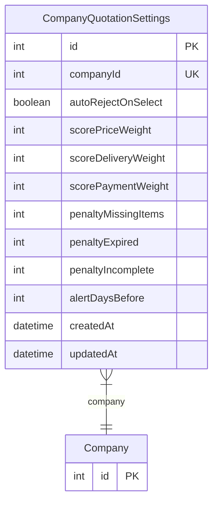

# CompanyQuotationSettings

> Table name: `company_quotation_settings`

**Schema location:** Lines 7921-7947

## Fields

| Field | Type | Required | Unique | Default | Notes |
|-------|------|----------|--------|---------|-------|
| `id` | `Int` | ✅ | 🔑 PK | `autoincrement(` |  |
| `companyId` | `Int` | ✅ | ✅ | `` |  |
| `autoRejectOnSelect` | `Boolean` | ✅ |  | `false` | Auto-rechazar otras al seleccionar |
| `scorePriceWeight` | `Int` | ✅ |  | `50` | Peso del precio (0-100) |
| `scoreDeliveryWeight` | `Int` | ✅ |  | `25` | Peso de entrega (0-100) |
| `scorePaymentWeight` | `Int` | ✅ |  | `25` | Peso de condiciones pago (0-100) |
| `penaltyMissingItems` | `Int` | ✅ |  | `10` | Penalización por item faltante |
| `penaltyExpired` | `Int` | ✅ |  | `20` | Penalización por vencida |
| `penaltyIncomplete` | `Int` | ✅ |  | `5` | Penalización por datos incompletos |
| `alertDaysBefore` | `Int` | ✅ |  | `7` | Días antes de vencer para alertar |
| `createdAt` | `DateTime` | ✅ |  | `now(` |  |
| `updatedAt` | `DateTime` | ✅ |  | `` |  |

## Relations

| Field | Type | Cardinality | FK Fields | References | On Delete |
|-------|------|-------------|-----------|------------|-----------|
| `company` | [Company](./models/Company.md) | Many-to-One | companyId | id | Cascade |

## Referenced By

| Model | Field | Cardinality |
|-------|-------|-------------|
| [Company](./models/Company.md) | `quotationSettings` | Has one |

## Entity Diagram

