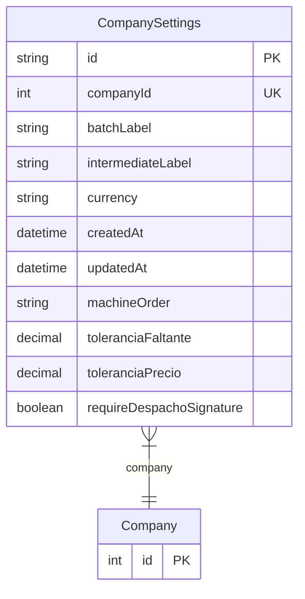

# CompanySettings

> Table name: `CompanySettings`

**Schema location:** Lines 332-349

## Fields

| Field | Type | Required | Unique | Default | Notes |
|-------|------|----------|--------|---------|-------|
| `id` | `String` | ✅ | 🔑 PK | `uuid(` |  |
| `companyId` | `Int` | ✅ | ✅ | `` |  |
| `batchLabel` | `String` | ✅ |  | `"batea"` |  |
| `intermediateLabel` | `String` | ✅ |  | `"placa"` |  |
| `currency` | `String` | ✅ |  | `"ARS"` |  |
| `createdAt` | `DateTime` | ✅ |  | `now(` |  |
| `updatedAt` | `DateTime` | ✅ |  | `` |  |
| `machineOrder` | `String?` | ❌ |  | `` |  |
| `toleranciaFaltante` | `Decimal` | ✅ |  | `0.02` | DB: Decimal(5, 4). 2% tolerancia qty |
| `toleranciaPrecio` | `Decimal` | ✅ |  | `0.05` | DB: Decimal(5, 4). 5% tolerancia precio |
| `requireDespachoSignature` | `Boolean` | ✅ |  | `false` | Requerir firma digital al confirmar recepción de despacho |

## Relations

| Field | Type | Cardinality | FK Fields | References | On Delete |
|-------|------|-------------|-----------|------------|-----------|
| `company` | [Company](./models/Company.md) | Many-to-One | companyId | id | Cascade |

## Referenced By

| Model | Field | Cardinality |
|-------|-------|-------------|
| [Company](./models/Company.md) | `settings` | Has one |

## Entity Diagram

