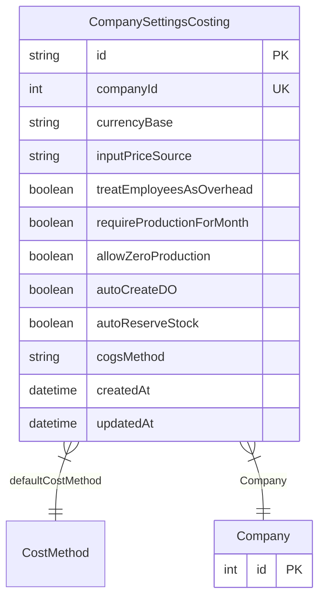

# CompanySettingsCosting

**Schema location:** Lines 2919-2934

## Fields

| Field | Type | Required | Unique | Default | Notes |
|-------|------|----------|--------|---------|-------|
| `id` | `String` | ✅ | 🔑 PK | `` |  |
| `companyId` | `Int` | ✅ | ✅ | `` |  |
| `currencyBase` | `String` | ✅ |  | `"ARS"` |  |
| `inputPriceSource` | `String` | ✅ |  | `"PRICE_HISTORY"` |  |
| `treatEmployeesAsOverhead` | `Boolean` | ✅ |  | `true` |  |
| `requireProductionForMonth` | `Boolean` | ✅ |  | `true` |  |
| `allowZeroProduction` | `Boolean` | ✅ |  | `false` |  |
| `autoCreateDO` | `Boolean` | ✅ |  | `true` |  |
| `autoReserveStock` | `Boolean` | ✅ |  | `true` |  |
| `cogsMethod` | `String` | ✅ |  | `"COST_HISTORY"` |  |
| `createdAt` | `DateTime` | ✅ |  | `now(` |  |
| `updatedAt` | `DateTime` | ✅ |  | `` |  |

## Relations

| Field | Type | Cardinality | FK Fields | References | On Delete |
|-------|------|-------------|-----------|------------|-----------|
| `defaultCostMethod` | [CostMethod](./models/CostMethod.md) | Many-to-One | - | - | - |
| `Company` | [Company](./models/Company.md) | Many-to-One | companyId | id | Cascade |

## Referenced By

| Model | Field | Cardinality |
|-------|-------|-------------|
| [Company](./models/Company.md) | `CompanySettingsCosting` | Has one |

## Entity Diagram

