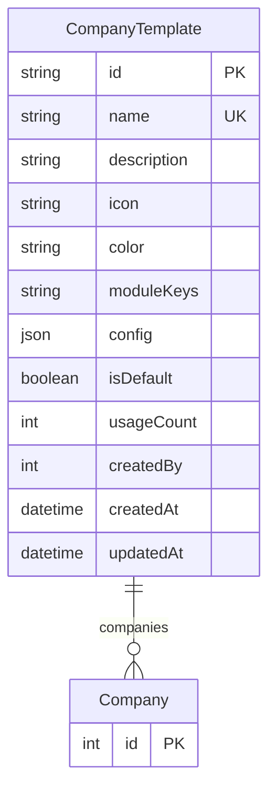

# CompanyTemplate

> Table name: `company_templates`

**Schema location:** Lines 11225-11253

## Fields

| Field | Type | Required | Unique | Default | Notes |
|-------|------|----------|--------|---------|-------|
| `id` | `String` | ✅ | 🔑 PK | `` |  |
| `name` | `String` | ✅ | ✅ | `` |  |
| `description` | `String?` | ❌ |  | `` |  |
| `icon` | `String?` | ❌ |  | `` |  |
| `color` | `String` | ✅ |  | `"#8B5CF6"` |  |
| `moduleKeys` | `String[]` | ✅ |  | `[]` | Módulos que incluye el template |
| `config` | `Json` | ✅ |  | `"{}"` | Config adicional (JSON) |
| `isDefault` | `Boolean` | ✅ |  | `false` | Flags |
| `usageCount` | `Int` | ✅ |  | `0` | Stats |
| `createdBy` | `Int?` | ❌ |  | `` | Audit |
| `createdAt` | `DateTime` | ✅ |  | `now(` |  |
| `updatedAt` | `DateTime` | ✅ |  | `` |  |

## Relations

| Field | Type | Cardinality | FK Fields | References | On Delete |
|-------|------|-------------|-----------|------------|-----------|
| `companies` | [Company](./models/Company.md) | One-to-Many | - | - | - |

## Referenced By

| Model | Field | Cardinality |
|-------|-------|-------------|
| [Company](./models/Company.md) | `template` | Has one |

## Entity Diagram

