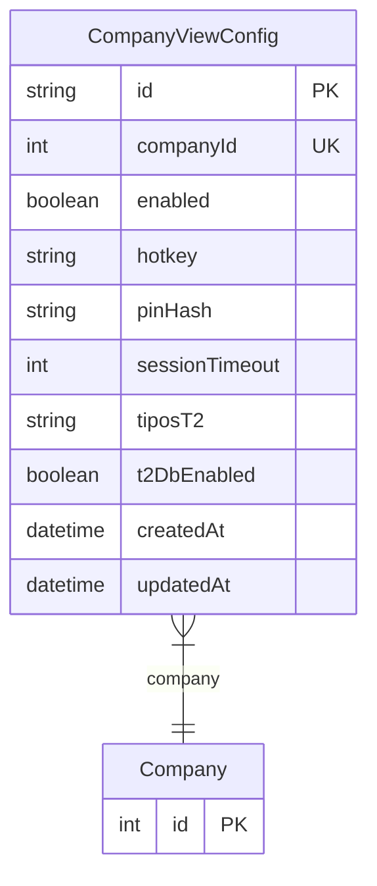

# CompanyViewConfig

> Table name: `company_view_config`

**Schema location:** Lines 7992-8009

## Fields

| Field | Type | Required | Unique | Default | Notes |
|-------|------|----------|--------|---------|-------|
| `id` | `String` | ✅ | 🔑 PK | `uuid(` |  |
| `companyId` | `Int` | ✅ | ✅ | `` |  |
| `enabled` | `Boolean` | ✅ |  | `false` |  |
| `hotkey` | `String?` | ❌ |  | `` | DB: VarChar(50) |
| `pinHash` | `String?` | ❌ |  | `` | DB: VarChar(100) |
| `sessionTimeout` | `Int` | ✅ |  | `30` |  |
| `tiposT2` | `String[]` | ✅ |  | `[]` | Ej: ["Presupuesto", "Remito Sin Factura", "Comprobante Interno"] |
| `t2DbEnabled` | `Boolean` | ✅ |  | `false` | Control de acceso a BD T2 separada (solo superadmin puede modificar) |
| `createdAt` | `DateTime` | ✅ |  | `now(` |  |
| `updatedAt` | `DateTime` | ✅ |  | `` |  |

## Relations

| Field | Type | Cardinality | FK Fields | References | On Delete |
|-------|------|-------------|-----------|------------|-----------|
| `company` | [Company](./models/Company.md) | Many-to-One | companyId | id | Cascade |

## Referenced By

| Model | Field | Cardinality |
|-------|-------|-------------|
| [Company](./models/Company.md) | `viewConfig` | Has one |

## Entity Diagram

