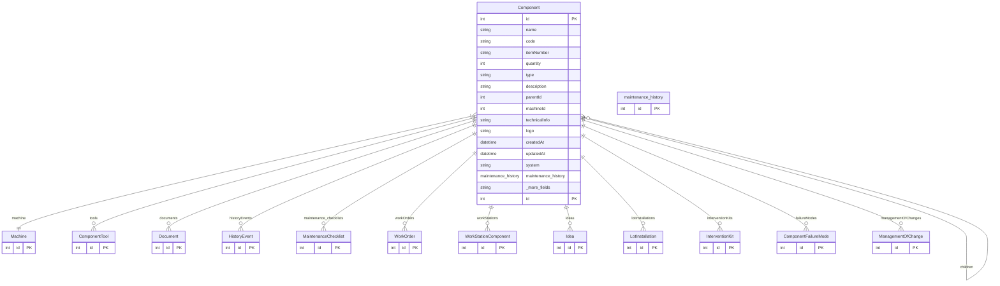

# Component

> Table name: `Component`

**Schema location:** Lines 1174-1223

## Fields

| Field | Type | Required | Unique | Default | Notes |
|-------|------|----------|--------|---------|-------|
| `id` | `Int` | ✅ | 🔑 PK | `autoincrement(` |  |
| `name` | `String` | ✅ |  | `` |  |
| `code` | `String?` | ❌ |  | `` | Código de parte/referencia |
| `itemNumber` | `String?` | ❌ |  | `` | Número de posición en el plano de despiece (1, 2, 3...) |
| `quantity` | `Int?` | ❌ |  | `1` | Cantidad en el ensamble (default 1) |
| `type` | `String?` | ❌ |  | `` |  |
| `description` | `String?` | ❌ |  | `` |  |
| `parentId` | `Int?` | ❌ |  | `` |  |
| `machineId` | `Int` | ✅ |  | `` |  |
| `technicalInfo` | `String?` | ❌ |  | `` |  |
| `logo` | `String?` | ❌ |  | `` |  |
| `createdAt` | `DateTime` | ✅ |  | `now(` |  |
| `updatedAt` | `DateTime` | ✅ |  | `` |  |
| `system` | `String?` | ❌ |  | `` |  |
| `maintenance_history` | `maintenance_history[]` | ✅ |  | `` |  |
| `model3dUrl` | `String?` | ❌ |  | `` | URL del modelo 3D (GLB/GLTF) |
| `criticality` | `Int?` | ❌ |  | `` | 1-10 |
| `isSafetyCritical` | `Boolean` | ✅ |  | `false` |  |

## Relations

| Field | Type | Cardinality | FK Fields | References | On Delete |
|-------|------|-------------|-----------|------------|-----------|
| `machine` | [Machine](./models/Machine.md) | Many-to-One | machineId | id | Cascade |
| `parent` | [Component](./models/Component.md) | Many-to-One (optional) | parentId | id | - |
| `children` | [Component](./models/Component.md) | One-to-Many | - | - | - |
| `tools` | [ComponentTool](./models/ComponentTool.md) | One-to-Many | - | - | - |
| `documents` | [Document](./models/Document.md) | One-to-Many | - | - | - |
| `historyEvents` | [HistoryEvent](./models/HistoryEvent.md) | One-to-Many | - | - | - |
| `maintenance_checklists` | [MaintenanceChecklist](./models/MaintenanceChecklist.md) | One-to-Many | - | - | - |
| `workOrders` | [WorkOrder](./models/WorkOrder.md) | One-to-Many | - | - | - |
| `workStations` | [WorkStationComponent](./models/WorkStationComponent.md) | One-to-Many | - | - | - |
| `ideas` | [Idea](./models/Idea.md) | One-to-Many | - | - | - |
| `lotInstallations` | [LotInstallation](./models/LotInstallation.md) | One-to-Many | - | - | - |
| `interventionKits` | [InterventionKit](./models/InterventionKit.md) | One-to-Many | - | - | - |
| `failureModes` | [ComponentFailureMode](./models/ComponentFailureMode.md) | One-to-Many | - | - | - |
| `managementOfChanges` | [ManagementOfChange](./models/ManagementOfChange.md) | One-to-Many | - | - | - |

## Referenced By

| Model | Field | Cardinality |
|-------|-------|-------------|
| [Machine](./models/Machine.md) | `components` | Has many |
| [ComponentTool](./models/ComponentTool.md) | `component` | Has one |
| [InterventionKit](./models/InterventionKit.md) | `component` | Has one |
| [LotInstallation](./models/LotInstallation.md) | `component` | Has one |
| [WorkOrder](./models/WorkOrder.md) | `component` | Has one |
| [Document](./models/Document.md) | `component` | Has one |
| [HistoryEvent](./models/HistoryEvent.md) | `component` | Has one |
| [WorkStationComponent](./models/WorkStationComponent.md) | `component` | Has one |
| [MaintenanceChecklist](./models/MaintenanceChecklist.md) | `Component` | Has one |
| [maintenance_history](./models/maintenance_history.md) | `Component` | Has one |
| [Idea](./models/Idea.md) | `component` | Has one |
| [ComponentFailureMode](./models/ComponentFailureMode.md) | `component` | Has one |
| [ManagementOfChange](./models/ManagementOfChange.md) | `component` | Has one |

## Indexes

- `machineId`
- `parentId`
- `machineId, parentId`
- `createdAt`
- `system`

## Entity Diagram

