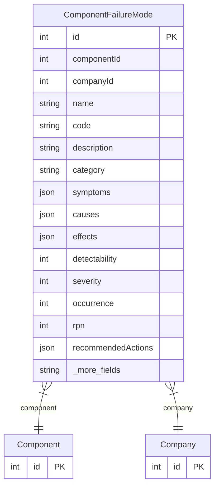

# ComponentFailureMode

> Table name: `component_failure_modes`

**Schema location:** Lines 13044-13090

## Fields

| Field | Type | Required | Unique | Default | Notes |
|-------|------|----------|--------|---------|-------|
| `id` | `Int` | ✅ | 🔑 PK | `autoincrement(` |  |
| `componentId` | `Int` | ✅ |  | `` |  |
| `companyId` | `Int` | ✅ |  | `` |  |
| `name` | `String` | ✅ |  | `` | Nombre del modo de falla (ej: "Desgaste de rodamiento") |
| `code` | `String?` | ❌ |  | `` | Código interno (ej: "FM-001") |
| `description` | `String?` | ❌ |  | `` | Descripción detallada |
| `category` | `String?` | ❌ |  | `` | Categoría (Mecánica, Eléctrica, Hidráulica, etc.) |
| `symptoms` | `Json?` | ❌ |  | `"[]"` | Array de síntomas típicos |
| `causes` | `Json?` | ❌ |  | `"[]"` | Causas comunes |
| `effects` | `Json?` | ❌ |  | `"[]"` | Efectos en producción/seguridad |
| `detectability` | `Int?` | ❌ |  | `` | Dificultad de detección (1=fácil, 10=difícil) |
| `severity` | `Int?` | ❌ |  | `` | Severidad del impacto (1=menor, 10=catastrófico) |
| `occurrence` | `Int?` | ❌ |  | `` | Frecuencia de ocurrencia (1=raro, 10=muy frecuente) |
| `rpn` | `Int?` | ❌ |  | `` | Risk Priority Number = detectability * severity * occurrence |
| `recommendedActions` | `Json?` | ❌ |  | `"[]"` | Recommended actions |
| `preventiveMeasures` | `String?` | ❌ |  | `` | Medidas preventivas recomendadas |
| `predictiveIndicators` | `String?` | ❌ |  | `` | Indicadores predictivos a monitorear |
| `isActive` | `Boolean` | ✅ |  | `true` | Status and metadata |
| `createdAt` | `DateTime` | ✅ |  | `now(` |  |
| `updatedAt` | `DateTime` | ✅ |  | `` |  |

## Relations

| Field | Type | Cardinality | FK Fields | References | On Delete |
|-------|------|-------------|-----------|------------|-----------|
| `component` | [Component](./models/Component.md) | Many-to-One | componentId | id | Cascade |
| `company` | [Company](./models/Company.md) | Many-to-One | companyId | id | Cascade |

## Referenced By

| Model | Field | Cardinality |
|-------|-------|-------------|
| [Company](./models/Company.md) | `componentFailureModes` | Has many |
| [Component](./models/Component.md) | `failureModes` | Has many |

## Indexes

- `componentId`
- `companyId`
- `category`
- `rpn`

## Unique Constraints

- `componentId, name`

## Entity Diagram

