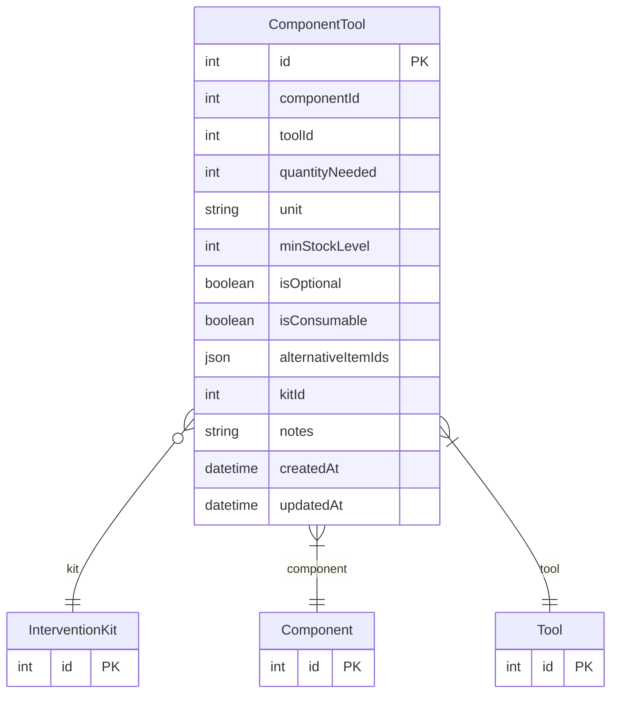

# ComponentTool

> Table name: `ComponentTool`

**Schema location:** Lines 1365-1386

## Fields

| Field | Type | Required | Unique | Default | Notes |
|-------|------|----------|--------|---------|-------|
| `id` | `Int` | ✅ | 🔑 PK | `autoincrement(` |  |
| `componentId` | `Int` | ✅ |  | `` |  |
| `toolId` | `Int` | ✅ |  | `` |  |
| `quantityNeeded` | `Int` | ✅ |  | `1` |  |
| `unit` | `String?` | ❌ |  | `"unidad"` | Unidad de medida |
| `minStockLevel` | `Int?` | ❌ |  | `` |  |
| `isOptional` | `Boolean` | ✅ |  | `false` |  |
| `isConsumable` | `Boolean` | ✅ |  | `false` | Se consume vs se instala permanente |
| `alternativeItemIds` | `Json?` | ❌ |  | `` | IDs de items alternativos aprobados |
| `kitId` | `Int?` | ❌ |  | `` | Si pertenece a un kit |
| `notes` | `String?` | ❌ |  | `` |  |
| `createdAt` | `DateTime` | ✅ |  | `now(` |  |
| `updatedAt` | `DateTime` | ✅ |  | `` |  |

## Relations

| Field | Type | Cardinality | FK Fields | References | On Delete |
|-------|------|-------------|-----------|------------|-----------|
| `kit` | [InterventionKit](./models/InterventionKit.md) | Many-to-One (optional) | kitId | id | - |
| `component` | [Component](./models/Component.md) | Many-to-One | componentId | id | Cascade |
| `tool` | [Tool](./models/Tool.md) | Many-to-One | toolId | id | Cascade |

## Referenced By

| Model | Field | Cardinality |
|-------|-------|-------------|
| [Component](./models/Component.md) | `tools` | Has many |
| [Tool](./models/Tool.md) | `components` | Has many |
| [InterventionKit](./models/InterventionKit.md) | `items` | Has many |

## Indexes

- `kitId`

## Unique Constraints

- `componentId, toolId`

## Entity Diagram

