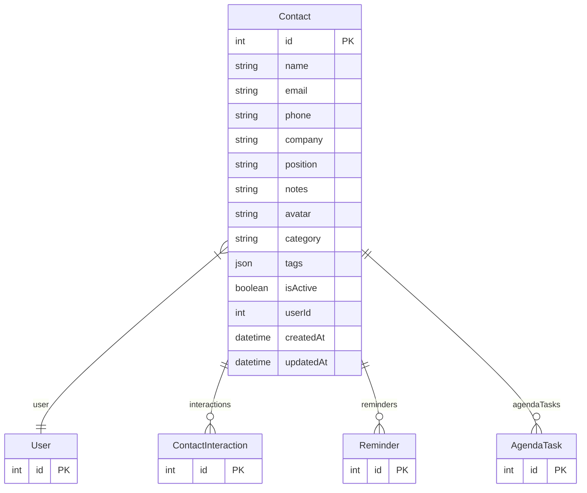

# Contact

> Table name: `Contact`

**Schema location:** Lines 2152-2175

## Fields

| Field | Type | Required | Unique | Default | Notes |
|-------|------|----------|--------|---------|-------|
| `id` | `Int` | ✅ | 🔑 PK | `autoincrement(` |  |
| `name` | `String` | ✅ |  | `` |  |
| `email` | `String?` | ❌ |  | `` |  |
| `phone` | `String?` | ❌ |  | `` |  |
| `company` | `String?` | ❌ |  | `` |  |
| `position` | `String?` | ❌ |  | `` |  |
| `notes` | `String?` | ❌ |  | `` |  |
| `avatar` | `String?` | ❌ |  | `` |  |
| `category` | `String?` | ❌ |  | `` |  |
| `tags` | `Json?` | ❌ |  | `` |  |
| `isActive` | `Boolean` | ✅ |  | `true` |  |
| `userId` | `Int` | ✅ |  | `` |  |
| `createdAt` | `DateTime` | ✅ |  | `now(` |  |
| `updatedAt` | `DateTime` | ✅ |  | `` |  |

## Relations

| Field | Type | Cardinality | FK Fields | References | On Delete |
|-------|------|-------------|-----------|------------|-----------|
| `user` | [User](./models/User.md) | Many-to-One | userId | id | Cascade |
| `interactions` | [ContactInteraction](./models/ContactInteraction.md) | One-to-Many | - | - | - |
| `reminders` | [Reminder](./models/Reminder.md) | One-to-Many | - | - | - |
| `agendaTasks` | [AgendaTask](./models/AgendaTask.md) | One-to-Many | - | - | - |

## Referenced By

| Model | Field | Cardinality |
|-------|-------|-------------|
| [User](./models/User.md) | `contacts` | Has many |
| [Reminder](./models/Reminder.md) | `contact` | Has one |
| [ContactInteraction](./models/ContactInteraction.md) | `contact` | Has one |
| [AgendaTask](./models/AgendaTask.md) | `assignedToContact` | Has one |

## Entity Diagram

