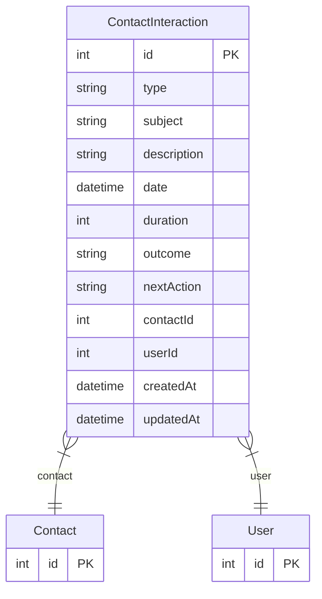

# ContactInteraction

> Table name: `ContactInteraction`

**Schema location:** Lines 2196-2213

## Fields

| Field | Type | Required | Unique | Default | Notes |
|-------|------|----------|--------|---------|-------|
| `id` | `Int` | ✅ | 🔑 PK | `autoincrement(` |  |
| `type` | `String` | ✅ |  | `` |  |
| `subject` | `String` | ✅ |  | `` |  |
| `description` | `String?` | ❌ |  | `` |  |
| `date` | `DateTime` | ✅ |  | `now(` |  |
| `duration` | `Int?` | ❌ |  | `` |  |
| `outcome` | `String?` | ❌ |  | `` |  |
| `nextAction` | `String?` | ❌ |  | `` |  |
| `contactId` | `Int` | ✅ |  | `` |  |
| `userId` | `Int` | ✅ |  | `` |  |
| `createdAt` | `DateTime` | ✅ |  | `now(` |  |
| `updatedAt` | `DateTime` | ✅ |  | `` |  |

## Relations

| Field | Type | Cardinality | FK Fields | References | On Delete |
|-------|------|-------------|-----------|------------|-----------|
| `contact` | [Contact](./models/Contact.md) | Many-to-One | contactId | id | Cascade |
| `user` | [User](./models/User.md) | Many-to-One | userId | id | Cascade |

## Referenced By

| Model | Field | Cardinality |
|-------|-------|-------------|
| [User](./models/User.md) | `contactInteractions` | Has many |
| [Contact](./models/Contact.md) | `interactions` | Has many |

## Entity Diagram

