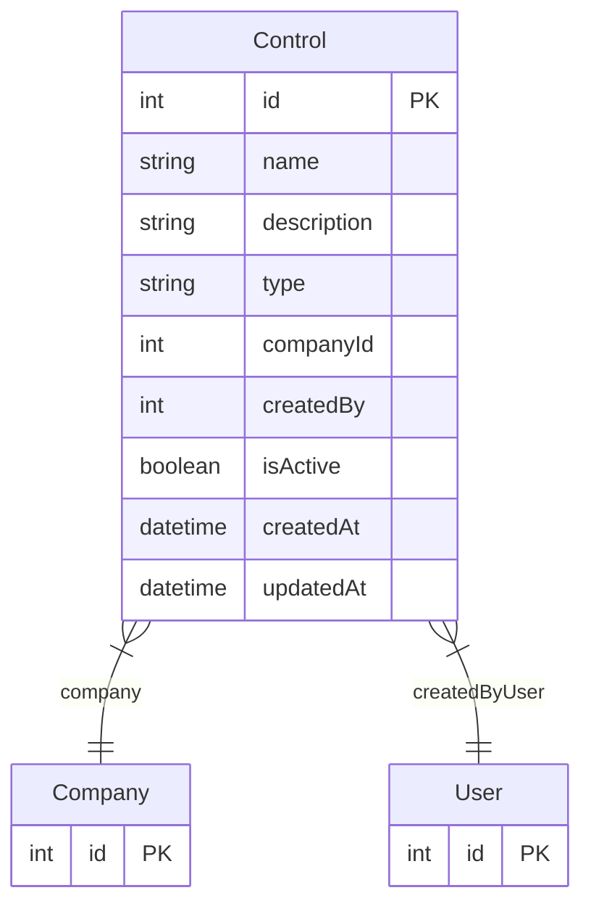

# Control

> Table name: `Control`

**Schema location:** Lines 4053-4071

## Fields

| Field | Type | Required | Unique | Default | Notes |
|-------|------|----------|--------|---------|-------|
| `id` | `Int` | ✅ | 🔑 PK | `autoincrement(` |  |
| `name` | `String` | ✅ |  | `` | DB: VarChar(255) |
| `description` | `String?` | ❌ |  | `` |  |
| `type` | `String` | ✅ |  | `` | DB: VarChar(50). 'tax', 'quality', 'production', 'financial', 'compliance', 'custom' |
| `companyId` | `Int` | ✅ |  | `` |  |
| `createdBy` | `Int` | ✅ |  | `` |  |
| `isActive` | `Boolean` | ✅ |  | `true` |  |
| `createdAt` | `DateTime` | ✅ |  | `now(` |  |
| `updatedAt` | `DateTime` | ✅ |  | `now(` |  |

## Relations

| Field | Type | Cardinality | FK Fields | References | On Delete |
|-------|------|-------------|-----------|------------|-----------|
| `company` | [Company](./models/Company.md) | Many-to-One | companyId | id | Cascade |
| `createdByUser` | [User](./models/User.md) | Many-to-One | createdBy | id | - |

## Referenced By

| Model | Field | Cardinality |
|-------|-------|-------------|
| [Company](./models/Company.md) | `controls` | Has many |
| [User](./models/User.md) | `controlsCreated` | Has many |

## Indexes

- `companyId`
- `type`
- `isActive`

## Unique Constraints

- `companyId, name, type`

## Entity Diagram

