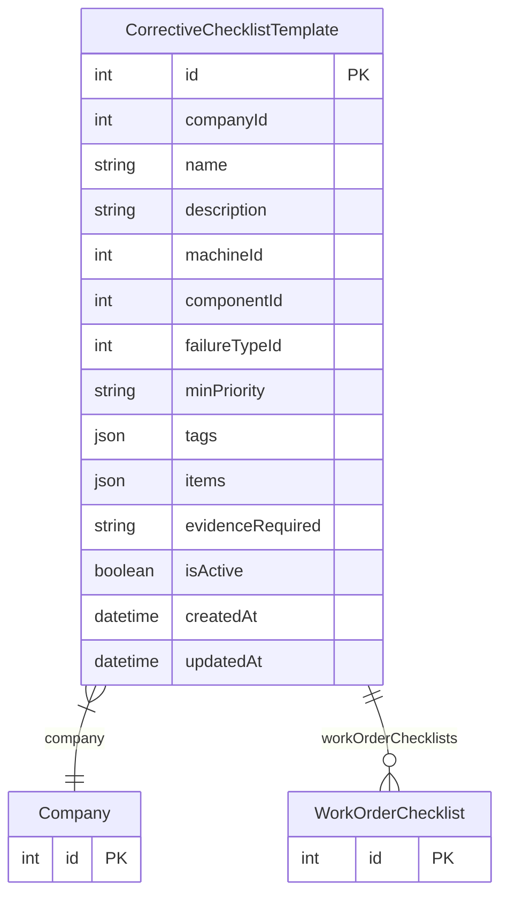

# CorrectiveChecklistTemplate

> Table name: `corrective_checklist_templates`

**Schema location:** Lines 5919-5950

## Fields

| Field | Type | Required | Unique | Default | Notes |
|-------|------|----------|--------|---------|-------|
| `id` | `Int` | ✅ | 🔑 PK | `autoincrement(` |  |
| `companyId` | `Int` | ✅ |  | `` |  |
| `name` | `String` | ✅ |  | `` | DB: VarChar(255) |
| `description` | `String?` | ❌ |  | `` | DB: Text |
| `machineId` | `Int?` | ❌ |  | `` | Scope - cuándo aplicar esta plantilla |
| `componentId` | `Int?` | ❌ |  | `` |  |
| `failureTypeId` | `Int?` | ❌ |  | `` |  |
| `minPriority` | `String?` | ❌ |  | `` | DB: VarChar(10). P1, P2, P3, P4 |
| `tags` | `Json?` | ❌ |  | `` | Array de tags para matching |
| `items` | `Json` | ✅ |  | `` | [{id, description, type: 'check'|'value'|'text', required, order}] |
| `evidenceRequired` | `String` | ✅ |  | `"OPTIONAL"` | DB: VarChar(20). OPTIONAL, BASIC, STANDARD, COMPLETE |
| `isActive` | `Boolean` | ✅ |  | `true` |  |
| `createdAt` | `DateTime` | ✅ |  | `now(` |  |
| `updatedAt` | `DateTime` | ✅ |  | `` |  |

## Relations

| Field | Type | Cardinality | FK Fields | References | On Delete |
|-------|------|-------------|-----------|------------|-----------|
| `company` | [Company](./models/Company.md) | Many-to-One | companyId | id | Cascade |
| `workOrderChecklists` | [WorkOrderChecklist](./models/WorkOrderChecklist.md) | One-to-Many | - | - | - |

## Referenced By

| Model | Field | Cardinality |
|-------|-------|-------------|
| [Company](./models/Company.md) | `correctiveChecklistTemplates` | Has many |
| [WorkOrderChecklist](./models/WorkOrderChecklist.md) | `template` | Has one |

## Indexes

- `companyId, isActive`
- `machineId`
- `componentId`

## Entity Diagram

