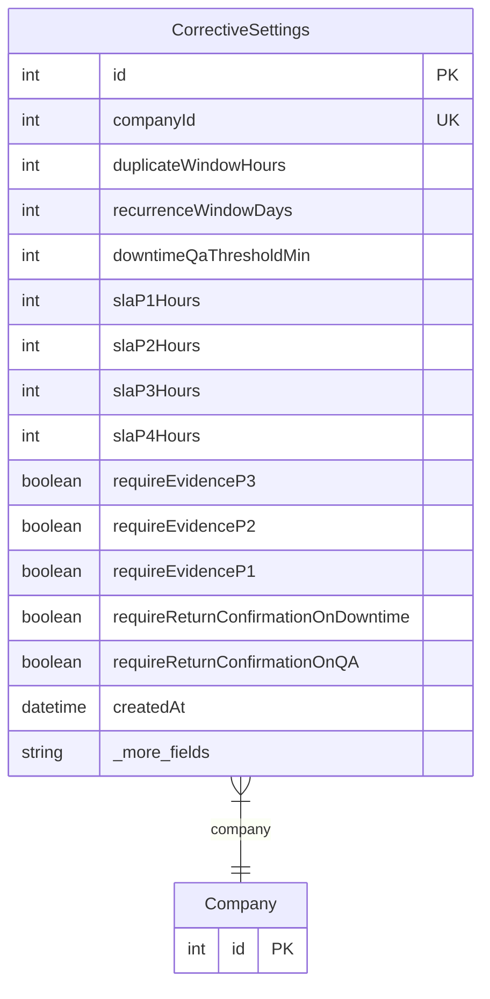

# CorrectiveSettings

> Table name: `corrective_settings`

**Schema location:** Lines 5782-5812

## Fields

| Field | Type | Required | Unique | Default | Notes |
|-------|------|----------|--------|---------|-------|
| `id` | `Int` | ✅ | 🔑 PK | `autoincrement(` |  |
| `companyId` | `Int` | ✅ | ✅ | `` |  |
| `duplicateWindowHours` | `Int` | ✅ |  | `48` | Ventana búsqueda duplicados |
| `recurrenceWindowDays` | `Int` | ✅ |  | `7` | Reincidencia rápida |
| `downtimeQaThresholdMin` | `Int` | ✅ |  | `60` | Downtime mínimo para QA |
| `slaP1Hours` | `Int` | ✅ |  | `4` | Urgente |
| `slaP2Hours` | `Int` | ✅ |  | `8` | Alta |
| `slaP3Hours` | `Int` | ✅ |  | `24` | Media |
| `slaP4Hours` | `Int` | ✅ |  | `72` | Baja |
| `requireEvidenceP3` | `Boolean` | ✅ |  | `true` | P3 requiere 1 evidencia |
| `requireEvidenceP2` | `Boolean` | ✅ |  | `true` | P2 requiere evidencia + checklist |
| `requireEvidenceP1` | `Boolean` | ✅ |  | `true` | P1 requiere todo |
| `requireReturnConfirmationOnDowntime` | `Boolean` | ✅ |  | `true` | Retorno a producción |
| `requireReturnConfirmationOnQA` | `Boolean` | ✅ |  | `true` |  |
| `createdAt` | `DateTime` | ✅ |  | `now(` |  |
| `updatedAt` | `DateTime` | ✅ |  | `` |  |

## Relations

| Field | Type | Cardinality | FK Fields | References | On Delete |
|-------|------|-------------|-----------|------------|-----------|
| `company` | [Company](./models/Company.md) | Many-to-One | companyId | id | Cascade |

## Referenced By

| Model | Field | Cardinality |
|-------|-------|-------------|
| [Company](./models/Company.md) | `correctiveSettings` | Has one |

## Entity Diagram

