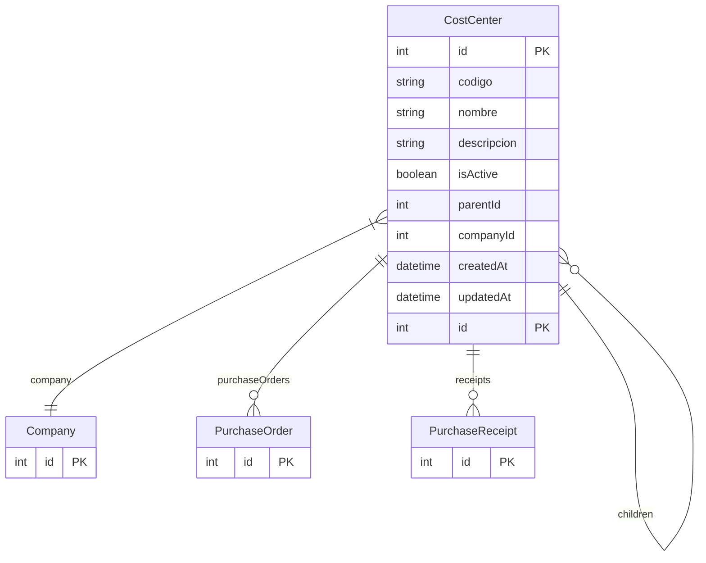

# CostCenter

> Table name: `cost_centers`

**Schema location:** Lines 7281-7302

## Fields

| Field | Type | Required | Unique | Default | Notes |
|-------|------|----------|--------|---------|-------|
| `id` | `Int` | ✅ | 🔑 PK | `autoincrement(` |  |
| `codigo` | `String` | ✅ |  | `` | DB: VarChar(50) |
| `nombre` | `String` | ✅ |  | `` | DB: VarChar(255) |
| `descripcion` | `String?` | ❌ |  | `` |  |
| `isActive` | `Boolean` | ✅ |  | `true` |  |
| `parentId` | `Int?` | ❌ |  | `` | Para jerarquía |
| `companyId` | `Int` | ✅ |  | `` |  |
| `createdAt` | `DateTime` | ✅ |  | `now(` |  |
| `updatedAt` | `DateTime` | ✅ |  | `` |  |

## Relations

| Field | Type | Cardinality | FK Fields | References | On Delete |
|-------|------|-------------|-----------|------------|-----------|
| `parent` | [CostCenter](./models/CostCenter.md) | Many-to-One (optional) | parentId | id | - |
| `children` | [CostCenter](./models/CostCenter.md) | One-to-Many | - | - | - |
| `company` | [Company](./models/Company.md) | Many-to-One | companyId | id | Cascade |
| `purchaseOrders` | [PurchaseOrder](./models/PurchaseOrder.md) | One-to-Many | - | - | - |
| `receipts` | [PurchaseReceipt](./models/PurchaseReceipt.md) | One-to-Many | - | - | - |

## Referenced By

| Model | Field | Cardinality |
|-------|-------|-------------|
| [Company](./models/Company.md) | `costCenters` | Has many |
| [PurchaseReceipt](./models/PurchaseReceipt.md) | `costCenter` | Has one |
| [PurchaseOrder](./models/PurchaseOrder.md) | `costCenter` | Has one |

## Indexes

- `companyId`
- `isActive`

## Unique Constraints

- `companyId, codigo`

## Entity Diagram

