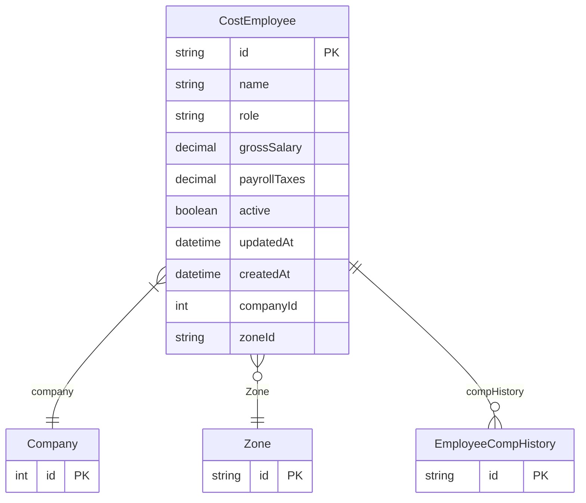

# CostEmployee

> Table name: `CostEmployee`

**Schema location:** Lines 2685-2701

## Fields

| Field | Type | Required | Unique | Default | Notes |
|-------|------|----------|--------|---------|-------|
| `id` | `String` | ✅ | 🔑 PK | `uuid(` |  |
| `name` | `String` | ✅ |  | `` |  |
| `role` | `String` | ✅ |  | `` |  |
| `grossSalary` | `Decimal` | ✅ |  | `` | DB: Decimal(12, 2) |
| `payrollTaxes` | `Decimal` | ✅ |  | `` | DB: Decimal(12, 2) |
| `active` | `Boolean` | ✅ |  | `true` |  |
| `updatedAt` | `DateTime` | ✅ |  | `` |  |
| `createdAt` | `DateTime` | ✅ |  | `now(` |  |
| `companyId` | `Int` | ✅ |  | `` |  |
| `zoneId` | `String?` | ❌ |  | `` |  |

## Relations

| Field | Type | Cardinality | FK Fields | References | On Delete |
|-------|------|-------------|-----------|------------|-----------|
| `company` | [Company](./models/Company.md) | Many-to-One | companyId | id | Cascade |
| `Zone` | [Zone](./models/Zone.md) | Many-to-One (optional) | zoneId | id | - |
| `compHistory` | [EmployeeCompHistory](./models/EmployeeCompHistory.md) | One-to-Many | - | - | - |

## Referenced By

| Model | Field | Cardinality |
|-------|-------|-------------|
| [Company](./models/Company.md) | `costEmployees` | Has many |
| [EmployeeCompHistory](./models/EmployeeCompHistory.md) | `employee` | Has one |
| [Zone](./models/Zone.md) | `CostEmployee` | Has many |

## Entity Diagram

