# CostProduct

> Table name: `CostProduct`

**Schema location:** Lines 2609-2636

## Fields

| Field | Type | Required | Unique | Default | Notes |
|-------|------|----------|--------|---------|-------|
| `id` | `String` | ✅ | 🔑 PK | `uuid(` |  |
| `lineId` | `String` | ✅ |  | `` |  |
| `name` | `String` | ✅ |  | `` |  |
| `unitLabel` | `String` | ✅ |  | `` |  |
| `active` | `Boolean` | ✅ |  | `true` |  |
| `createdAt` | `DateTime` | ✅ |  | `now(` |  |
| `updatedAt` | `DateTime` | ✅ |  | `` |  |
| `companyId` | `Int` | ✅ |  | `` |  |

## Relations

| Field | Type | Cardinality | FK Fields | References | On Delete |
|-------|------|-------------|-----------|------------|-----------|
| `measureKind` | [MeasureKind](./models/MeasureKind.md) | Many-to-One | - | - | - |
| `costMethod` | [CostMethod](./models/CostMethod.md) | Many-to-One | - | - | - |
| `company` | [Company](./models/Company.md) | Many-to-One | companyId | id | Cascade |
| `line` | [Line](./models/Line.md) | Many-to-One | lineId | id | Cascade |
| `CostVarianceMonthly` | [CostVarianceMonthly](./models/CostVarianceMonthly.md) | One-to-Many | - | - | - |
| `MethodProductYield` | [MethodProductYield](./models/MethodProductYield.md) | One-to-Many | - | - | - |
| `monthlyProductions` | [MonthlyProduction](./models/MonthlyProduction.md) | One-to-Many | - | - | - |
| `perUnitBOM` | [PerUnitBOM](./models/PerUnitBOM.md) | One-to-Many | - | - | - |
| `costHistory` | [ProductCostHistory](./models/ProductCostHistory.md) | One-to-Many | - | - | - |
| `ProductStandardCost` | [ProductStandardCost](./models/ProductStandardCost.md) | One-to-Many | - | - | - |
| `variant` | [ProductVariant](./models/ProductVariant.md) | Many-to-One (optional) | - | - | - |
| `volumetricParam` | [VolumetricParam](./models/VolumetricParam.md) | Many-to-One (optional) | - | - | - |
| `yieldConfig` | [YieldConfig](./models/YieldConfig.md) | Many-to-One (optional) | - | - | - |
| `productionOrders` | [ProductionOrder](./models/ProductionOrder.md) | One-to-Many | - | - | - |

## Referenced By

| Model | Field | Cardinality |
|-------|-------|-------------|
| [Company](./models/Company.md) | `costProducts` | Has many |
| [Line](./models/Line.md) | `products` | Has many |
| [ProductVariant](./models/ProductVariant.md) | `product` | Has one |
| [YieldConfig](./models/YieldConfig.md) | `product` | Has one |
| [PerUnitBOM](./models/PerUnitBOM.md) | `product` | Has one |
| [VolumetricParam](./models/VolumetricParam.md) | `product` | Has one |
| [MonthlyProduction](./models/MonthlyProduction.md) | `product` | Has one |
| [ProductCostHistory](./models/ProductCostHistory.md) | `product` | Has one |
| [CostVarianceMonthly](./models/CostVarianceMonthly.md) | `CostProduct` | Has one |
| [MethodProductYield](./models/MethodProductYield.md) | `CostProduct` | Has one |
| [ProductStandardCost](./models/ProductStandardCost.md) | `CostProduct` | Has one |
| [ProductionOrder](./models/ProductionOrder.md) | `product` | Has one |

## Entity Diagram

```mermaid
erDiagram
    CostProduct {
        string id PK
        string lineId
        string name
        string unitLabel
        boolean active
        datetime createdAt
        datetime updatedAt
        int companyId
    }
    Company {
        int id PK
    }
    Line {
        string id PK
    }
    CostVarianceMonthly {
        string id PK
    }
    MethodProductYield {
        string id PK
    }
    MonthlyProduction {
        string id PK
    }
    PerUnitBOM {
        string id PK
    }
    ProductCostHistory {
        string id PK
    }
    ProductStandardCost {
        string id PK
    }
    ProductVariant {
        string id PK
    }
    VolumetricParam {
        string id PK
    }
    YieldConfig {
        string id PK
    }
    ProductionOrder {
        int id PK
    }
    CostProduct }|--|| MeasureKind : "measureKind"
    CostProduct }|--|| CostMethod : "costMethod"
    CostProduct }|--|| Company : "company"
    CostProduct }|--|| Line : "line"
    CostProduct ||--o{ CostVarianceMonthly : "CostVarianceMonthly"
    CostProduct ||--o{ MethodProductYield : "MethodProductYield"
    CostProduct ||--o{ MonthlyProduction : "monthlyProductions"
    CostProduct ||--o{ PerUnitBOM : "perUnitBOM"
    CostProduct ||--o{ ProductCostHistory : "costHistory"
    CostProduct ||--o{ ProductStandardCost : "ProductStandardCost"
    CostProduct }o--|| ProductVariant : "variant"
    CostProduct }o--|| VolumetricParam : "volumetricParam"
    CostProduct }o--|| YieldConfig : "yieldConfig"
    CostProduct ||--o{ ProductionOrder : "productionOrders"
```

