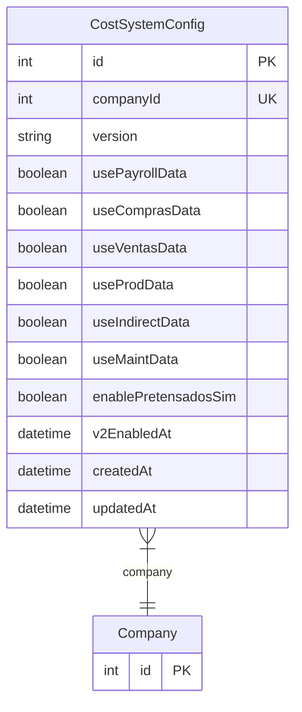

# CostSystemConfig

> Table name: `cost_system_configs`

**Schema location:** Lines 12691-12716

## Fields

| Field | Type | Required | Unique | Default | Notes |
|-------|------|----------|--------|---------|-------|
| `id` | `Int` | ✅ | 🔑 PK | `autoincrement(` |  |
| `companyId` | `Int` | ✅ | ✅ | `` |  |
| `version` | `String` | ✅ |  | `"V1"` | "V1" | "V2" | "HYBRID" |
| `usePayrollData` | `Boolean` | ✅ |  | `false` | Fuentes habilitadas para V2 |
| `useComprasData` | `Boolean` | ✅ |  | `false` |  |
| `useVentasData` | `Boolean` | ✅ |  | `false` |  |
| `useProdData` | `Boolean` | ✅ |  | `false` |  |
| `useIndirectData` | `Boolean` | ✅ |  | `false` |  |
| `useMaintData` | `Boolean` | ✅ |  | `false` | Read-only desde MaintenanceCostBreakdown |
| `enablePretensadosSim` | `Boolean` | ✅ |  | `false` | Viguetas×bancos, Bloques×placas, Adoquines×m² |
| `v2EnabledAt` | `DateTime?` | ❌ |  | `` |  |
| `createdAt` | `DateTime` | ✅ |  | `now(` |  |
| `updatedAt` | `DateTime` | ✅ |  | `` |  |

## Relations

| Field | Type | Cardinality | FK Fields | References | On Delete |
|-------|------|-------------|-----------|------------|-----------|
| `company` | [Company](./models/Company.md) | Many-to-One | companyId | id | Cascade |

## Referenced By

| Model | Field | Cardinality |
|-------|-------|-------------|
| [Company](./models/Company.md) | `costSystemConfig` | Has one |

## Entity Diagram

