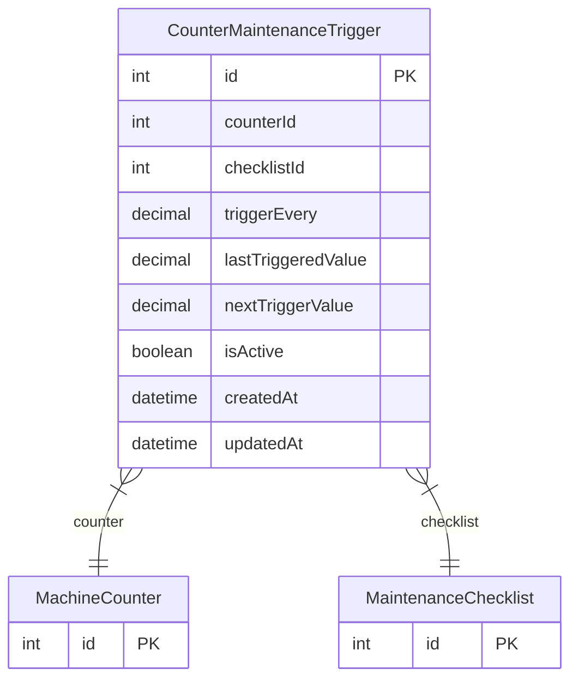

# CounterMaintenanceTrigger

> Table name: `counter_maintenance_triggers`

**Schema location:** Lines 13257-13275

## Fields

| Field | Type | Required | Unique | Default | Notes |
|-------|------|----------|--------|---------|-------|
| `id` | `Int` | ✅ | 🔑 PK | `autoincrement(` |  |
| `counterId` | `Int` | ✅ |  | `` |  |
| `checklistId` | `Int` | ✅ |  | `` |  |
| `triggerEvery` | `Decimal` | ✅ |  | `` | Cada X unidades |
| `lastTriggeredValue` | `Decimal` | ✅ |  | `0` |  |
| `nextTriggerValue` | `Decimal?` | ❌ |  | `` |  |
| `isActive` | `Boolean` | ✅ |  | `true` |  |
| `createdAt` | `DateTime` | ✅ |  | `now(` |  |
| `updatedAt` | `DateTime` | ✅ |  | `` |  |

## Relations

| Field | Type | Cardinality | FK Fields | References | On Delete |
|-------|------|-------------|-----------|------------|-----------|
| `counter` | [MachineCounter](./models/MachineCounter.md) | Many-to-One | counterId | id | Cascade |
| `checklist` | [MaintenanceChecklist](./models/MaintenanceChecklist.md) | Many-to-One | checklistId | id | Cascade |

## Referenced By

| Model | Field | Cardinality |
|-------|-------|-------------|
| [MaintenanceChecklist](./models/MaintenanceChecklist.md) | `counterTriggers` | Has many |
| [MachineCounter](./models/MachineCounter.md) | `triggers` | Has many |

## Indexes

- `counterId`
- `checklistId`

## Entity Diagram

