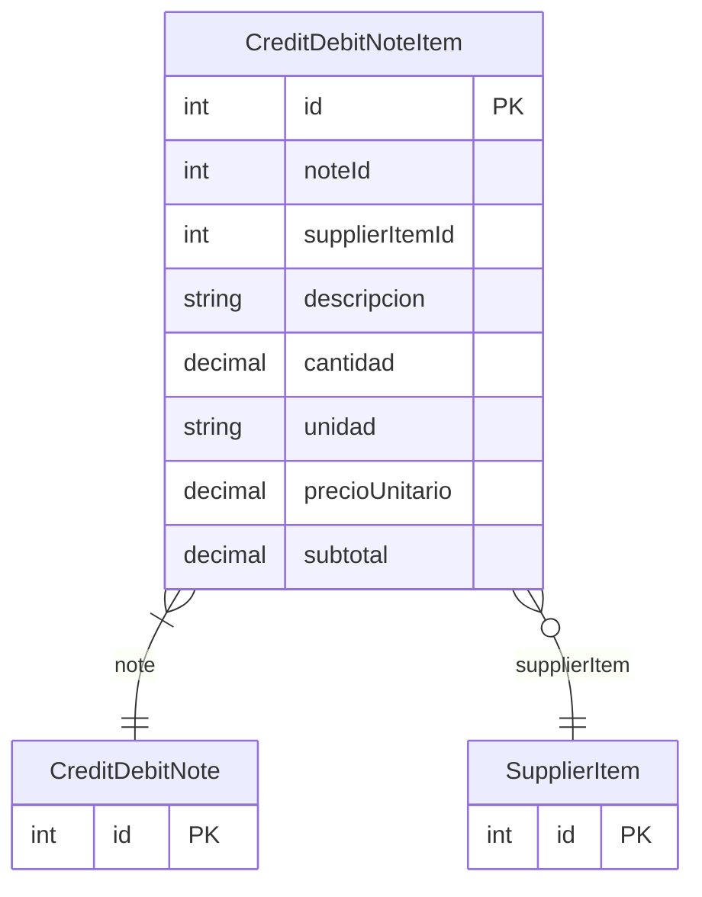

# CreditDebitNoteItem

> Table name: `credit_debit_note_items`

**Schema location:** Lines 6805-6820

## Fields

| Field | Type | Required | Unique | Default | Notes |
|-------|------|----------|--------|---------|-------|
| `id` | `Int` | ✅ | 🔑 PK | `autoincrement(` |  |
| `noteId` | `Int` | ✅ |  | `` |  |
| `supplierItemId` | `Int?` | ❌ |  | `` |  |
| `descripcion` | `String` | ✅ |  | `` | DB: VarChar(255) |
| `cantidad` | `Decimal` | ✅ |  | `` | DB: Decimal(15, 4) |
| `unidad` | `String` | ✅ |  | `` | DB: VarChar(50) |
| `precioUnitario` | `Decimal` | ✅ |  | `` | DB: Decimal(15, 2) |
| `subtotal` | `Decimal` | ✅ |  | `` | DB: Decimal(15, 2) |

## Relations

| Field | Type | Cardinality | FK Fields | References | On Delete |
|-------|------|-------------|-----------|------------|-----------|
| `note` | [CreditDebitNote](./models/CreditDebitNote.md) | Many-to-One | noteId | id | Cascade |
| `supplierItem` | [SupplierItem](./models/SupplierItem.md) | Many-to-One (optional) | supplierItemId | id | - |

## Referenced By

| Model | Field | Cardinality |
|-------|-------|-------------|
| [SupplierItem](./models/SupplierItem.md) | `creditDebitNoteItems` | Has many |
| [CreditDebitNote](./models/CreditDebitNote.md) | `items` | Has many |

## Indexes

- `noteId`

## Entity Diagram

