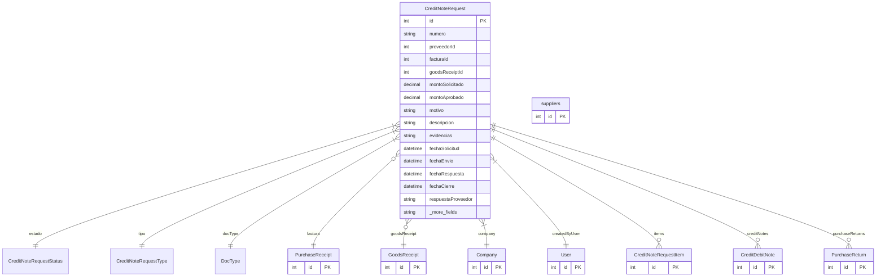

# CreditNoteRequest

> Table name: `credit_note_requests`

**Schema location:** Lines 6835-6892

## Fields

| Field | Type | Required | Unique | Default | Notes |
|-------|------|----------|--------|---------|-------|
| `id` | `Int` | ✅ | 🔑 PK | `autoincrement(` |  |
| `numero` | `String` | ✅ |  | `` | DB: VarChar(50). SNCA-2026-00001 |
| `proveedorId` | `Int` | ✅ |  | `` |  |
| `facturaId` | `Int?` | ❌ |  | `` | Factura de referencia |
| `goodsReceiptId` | `Int?` | ❌ |  | `` | Recepción de referencia |
| `montoSolicitado` | `Decimal` | ✅ |  | `` | DB: Decimal(15, 2). Montos |
| `montoAprobado` | `Decimal?` | ❌ |  | `` | DB: Decimal(15, 2) |
| `motivo` | `String` | ✅ |  | `` | Descripción |
| `descripcion` | `String?` | ❌ |  | `` |  |
| `evidencias` | `String[]` | ✅ |  | `` | URLs a fotos/documentos |
| `fechaSolicitud` | `DateTime` | ✅ |  | `now(` | Fechas |
| `fechaEnvio` | `DateTime?` | ❌ |  | `` | Cuando se envió al proveedor |
| `fechaRespuesta` | `DateTime?` | ❌ |  | `` | Cuando el proveedor respondió |
| `fechaCierre` | `DateTime?` | ❌ |  | `` |  |
| `respuestaProveedor` | `String?` | ❌ |  | `` | Respuesta del proveedor |
| `companyId` | `Int` | ✅ |  | `` | Tracking |
| `createdBy` | `Int` | ✅ |  | `` |  |
| `createdAt` | `DateTime` | ✅ |  | `now(` |  |
| `updatedAt` | `DateTime` | ✅ |  | `` |  |
| `proveedor` | `suppliers` | ✅ |  | `` | Relaciones |

## Relations

| Field | Type | Cardinality | FK Fields | References | On Delete |
|-------|------|-------------|-----------|------------|-----------|
| `estado` | [CreditNoteRequestStatus](./models/CreditNoteRequestStatus.md) | Many-to-One | - | - | - |
| `tipo` | [CreditNoteRequestType](./models/CreditNoteRequestType.md) | Many-to-One | - | - | - |
| `docType` | [DocType](./models/DocType.md) | Many-to-One | - | - | - |
| `factura` | [PurchaseReceipt](./models/PurchaseReceipt.md) | Many-to-One (optional) | facturaId | id | - |
| `goodsReceipt` | [GoodsReceipt](./models/GoodsReceipt.md) | Many-to-One (optional) | goodsReceiptId | id | - |
| `company` | [Company](./models/Company.md) | Many-to-One | companyId | id | Cascade |
| `createdByUser` | [User](./models/User.md) | Many-to-One | createdBy | id | - |
| `items` | [CreditNoteRequestItem](./models/CreditNoteRequestItem.md) | One-to-Many | - | - | - |
| `creditNotes` | [CreditDebitNote](./models/CreditDebitNote.md) | One-to-Many | - | - | - |
| `purchaseReturns` | [PurchaseReturn](./models/PurchaseReturn.md) | One-to-Many | - | - | - |

## Referenced By

| Model | Field | Cardinality |
|-------|-------|-------------|
| [Company](./models/Company.md) | `creditNoteRequests` | Has many |
| [User](./models/User.md) | `creditNoteRequestsCreated` | Has many |
| [suppliers](./models/suppliers.md) | `creditNoteRequests` | Has many |
| [PurchaseReceipt](./models/PurchaseReceipt.md) | `creditNoteRequests` | Has many |
| [GoodsReceipt](./models/GoodsReceipt.md) | `creditNoteRequests` | Has many |
| [CreditDebitNote](./models/CreditDebitNote.md) | `request` | Has one |
| [CreditNoteRequestItem](./models/CreditNoteRequestItem.md) | `request` | Has one |
| [PurchaseReturn](./models/PurchaseReturn.md) | `creditNoteRequest` | Has one |

## Indexes

- `companyId`
- `estado`
- `proveedorId`
- `facturaId`
- `docType`
- `companyId, docType`

## Unique Constraints

- `companyId, numero`

## Entity Diagram

