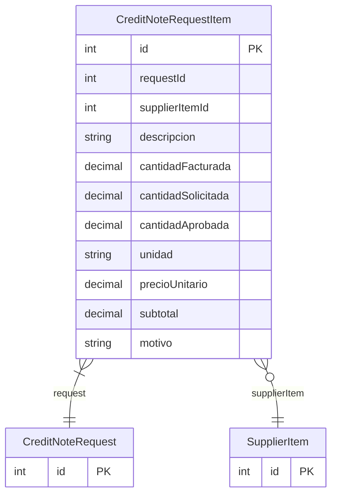

# CreditNoteRequestItem

> Table name: `credit_note_request_items`

**Schema location:** Lines 6894-6912

## Fields

| Field | Type | Required | Unique | Default | Notes |
|-------|------|----------|--------|---------|-------|
| `id` | `Int` | ✅ | 🔑 PK | `autoincrement(` |  |
| `requestId` | `Int` | ✅ |  | `` |  |
| `supplierItemId` | `Int?` | ❌ |  | `` |  |
| `descripcion` | `String` | ✅ |  | `` |  |
| `cantidadFacturada` | `Decimal` | ✅ |  | `` | DB: Decimal(15, 4) |
| `cantidadSolicitada` | `Decimal` | ✅ |  | `` | DB: Decimal(15, 4) |
| `cantidadAprobada` | `Decimal?` | ❌ |  | `` | DB: Decimal(15, 4) |
| `unidad` | `String` | ✅ |  | `` | DB: VarChar(20) |
| `precioUnitario` | `Decimal` | ✅ |  | `` | DB: Decimal(15, 4) |
| `subtotal` | `Decimal` | ✅ |  | `` | DB: Decimal(15, 2) |
| `motivo` | `String?` | ❌ |  | `` |  |

## Relations

| Field | Type | Cardinality | FK Fields | References | On Delete |
|-------|------|-------------|-----------|------------|-----------|
| `request` | [CreditNoteRequest](./models/CreditNoteRequest.md) | Many-to-One | requestId | id | Cascade |
| `supplierItem` | [SupplierItem](./models/SupplierItem.md) | Many-to-One (optional) | supplierItemId | id | - |

## Referenced By

| Model | Field | Cardinality |
|-------|-------|-------------|
| [SupplierItem](./models/SupplierItem.md) | `creditNoteRequestItems` | Has many |
| [CreditNoteRequest](./models/CreditNoteRequest.md) | `items` | Has many |

## Indexes

- `requestId`

## Entity Diagram

