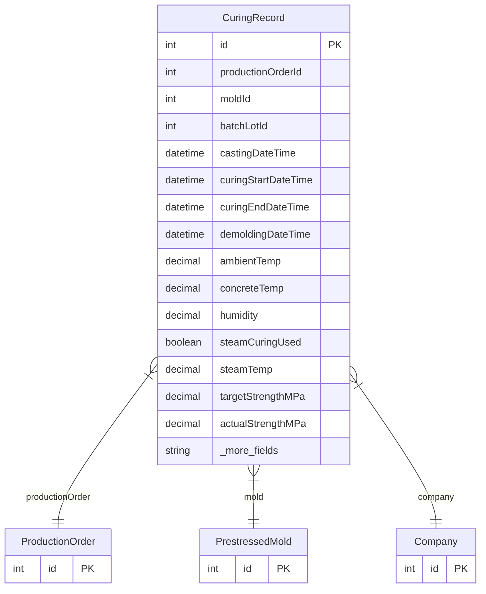

# CuringRecord

> Table name: `curing_records`

**Schema location:** Lines 14165-14202

## Fields

| Field | Type | Required | Unique | Default | Notes |
|-------|------|----------|--------|---------|-------|
| `id` | `Int` | ✅ | 🔑 PK | `autoincrement(` |  |
| `productionOrderId` | `Int` | ✅ |  | `` |  |
| `moldId` | `Int` | ✅ |  | `` |  |
| `batchLotId` | `Int?` | ❌ |  | `` |  |
| `castingDateTime` | `DateTime` | ✅ |  | `` | Tiempos |
| `curingStartDateTime` | `DateTime?` | ❌ |  | `` |  |
| `curingEndDateTime` | `DateTime?` | ❌ |  | `` |  |
| `demoldingDateTime` | `DateTime?` | ❌ |  | `` |  |
| `ambientTemp` | `Decimal?` | ❌ |  | `` | DB: Decimal(5, 2). Condiciones |
| `concreteTemp` | `Decimal?` | ❌ |  | `` | DB: Decimal(5, 2) |
| `humidity` | `Decimal?` | ❌ |  | `` | DB: Decimal(5, 2) |
| `steamCuringUsed` | `Boolean` | ✅ |  | `false` | Curado vapor (si aplica) |
| `steamTemp` | `Decimal?` | ❌ |  | `` | DB: Decimal(5, 2) |
| `targetStrengthMPa` | `Decimal?` | ❌ |  | `` | DB: Decimal(8, 2). Resistencia |
| `actualStrengthMPa` | `Decimal?` | ❌ |  | `` | DB: Decimal(8, 2) |
| `companyId` | `Int` | ✅ |  | `` |  |
| `createdAt` | `DateTime` | ✅ |  | `now(` |  |
| `updatedAt` | `DateTime` | ✅ |  | `` |  |

## Relations

| Field | Type | Cardinality | FK Fields | References | On Delete |
|-------|------|-------------|-----------|------------|-----------|
| `productionOrder` | [ProductionOrder](./models/ProductionOrder.md) | Many-to-One | productionOrderId | id | - |
| `mold` | [PrestressedMold](./models/PrestressedMold.md) | Many-to-One | moldId | id | - |
| `company` | [Company](./models/Company.md) | Many-to-One | companyId | id | Cascade |

## Referenced By

| Model | Field | Cardinality |
|-------|-------|-------------|
| [Company](./models/Company.md) | `curingRecords` | Has many |
| [ProductionOrder](./models/ProductionOrder.md) | `curingRecords` | Has many |
| [PrestressedMold](./models/PrestressedMold.md) | `curingRecords` | Has many |

## Indexes

- `productionOrderId`
- `moldId`

## Entity Diagram

