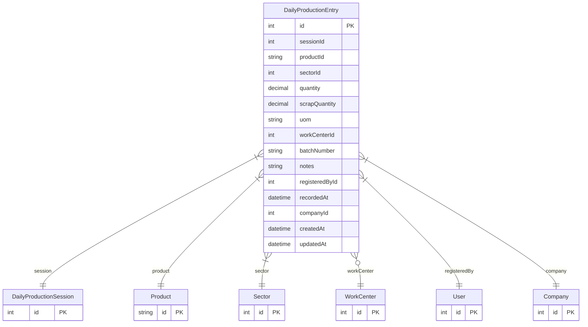

# DailyProductionEntry

> Table name: `daily_production_entries`

**Schema location:** Lines 14043-14071

## Fields

| Field | Type | Required | Unique | Default | Notes |
|-------|------|----------|--------|---------|-------|
| `id` | `Int` | ✅ | 🔑 PK | `autoincrement(` |  |
| `sessionId` | `Int` | ✅ |  | `` |  |
| `productId` | `String` | ✅ |  | `` |  |
| `sectorId` | `Int` | ✅ |  | `` |  |
| `quantity` | `Decimal` | ✅ |  | `` | DB: Decimal(12, 2) |
| `scrapQuantity` | `Decimal` | ✅ |  | `0` | DB: Decimal(12, 2) |
| `uom` | `String` | ✅ |  | `"unidad"` |  |
| `workCenterId` | `Int?` | ❌ |  | `` |  |
| `batchNumber` | `String?` | ❌ |  | `` |  |
| `notes` | `String?` | ❌ |  | `` |  |
| `registeredById` | `Int` | ✅ |  | `` |  |
| `recordedAt` | `DateTime` | ✅ |  | `now(` |  |
| `companyId` | `Int` | ✅ |  | `` |  |
| `createdAt` | `DateTime` | ✅ |  | `now(` |  |
| `updatedAt` | `DateTime` | ✅ |  | `` |  |

## Relations

| Field | Type | Cardinality | FK Fields | References | On Delete |
|-------|------|-------------|-----------|------------|-----------|
| `session` | [DailyProductionSession](./models/DailyProductionSession.md) | Many-to-One | sessionId | id | Cascade |
| `product` | [Product](./models/Product.md) | Many-to-One | productId | id | - |
| `sector` | [Sector](./models/Sector.md) | Many-to-One | sectorId | id | - |
| `workCenter` | [WorkCenter](./models/WorkCenter.md) | Many-to-One (optional) | workCenterId | id | - |
| `registeredBy` | [User](./models/User.md) | Many-to-One | registeredById | id | - |
| `company` | [Company](./models/Company.md) | Many-to-One | companyId | id | Cascade |

## Referenced By

| Model | Field | Cardinality |
|-------|-------|-------------|
| [Company](./models/Company.md) | `dailyProductionEntries` | Has many |
| [User](./models/User.md) | `dailyEntriesRegistered` | Has many |
| [Sector](./models/Sector.md) | `dailyProductionEntries` | Has many |
| [Product](./models/Product.md) | `dailyProductionEntries` | Has many |
| [WorkCenter](./models/WorkCenter.md) | `dailyProductionEntries` | Has many |
| [DailyProductionSession](./models/DailyProductionSession.md) | `entries` | Has many |

## Indexes

- `sessionId`
- `companyId, sectorId, recordedAt`
- `productId`

## Entity Diagram

