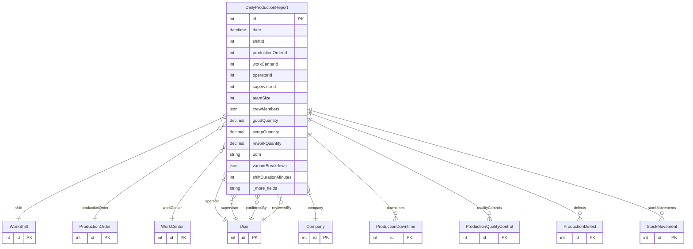

# DailyProductionReport

> Table name: `daily_production_reports`

**Schema location:** Lines 13617-13690

## Fields

| Field | Type | Required | Unique | Default | Notes |
|-------|------|----------|--------|---------|-------|
| `id` | `Int` | ✅ | 🔑 PK | `autoincrement(` |  |
| `date` | `DateTime` | ✅ |  | `` | DB: Date. Contexto |
| `shiftId` | `Int` | ✅ |  | `` |  |
| `productionOrderId` | `Int?` | ❌ |  | `` |  |
| `workCenterId` | `Int?` | ❌ |  | `` |  |
| `operatorId` | `Int` | ✅ |  | `` | Equipo |
| `supervisorId` | `Int?` | ❌ |  | `` |  |
| `teamSize` | `Int?` | ❌ |  | `` | Cantidad de personas en el turno |
| `crewMembers` | `Json?` | ❌ |  | `` | [{userId, role}] - opcional |
| `goodQuantity` | `Decimal` | ✅ |  | `` | DB: Decimal(12, 4). Producción |
| `scrapQuantity` | `Decimal` | ✅ |  | `0` | DB: Decimal(12, 4) |
| `reworkQuantity` | `Decimal` | ✅ |  | `0` | DB: Decimal(12, 4) |
| `uom` | `String` | ✅ |  | `` | "unidades", "m2", "metros" |
| `variantBreakdown` | `Json?` | ❌ |  | `` | [{variantCode, quantity, uom}] |
| `shiftDurationMinutes` | `Int` | ✅ |  | `` | Tiempos |
| `productiveMinutes` | `Int` | ✅ |  | `` |  |
| `downtimeMinutes` | `Int` | ✅ |  | `0` |  |
| `setupMinutes` | `Int` | ✅ |  | `0` |  |
| `observations` | `String?` | ❌ |  | `` | Observaciones |
| `issues` | `String?` | ❌ |  | `` |  |
| `attachmentUrls` | `Json?` | ❌ |  | `` | URLs de fotos/documentos |
| `isConfirmed` | `Boolean` | ✅ |  | `false` | Confirmación |
| `confirmedAt` | `DateTime?` | ❌ |  | `` |  |
| `confirmedById` | `Int?` | ❌ |  | `` |  |
| `isReviewed` | `Boolean` | ✅ |  | `false` | Revisión opcional (segundo nivel) |
| `reviewedAt` | `DateTime?` | ❌ |  | `` |  |
| `reviewedById` | `Int?` | ❌ |  | `` |  |
| `reviewNotes` | `String?` | ❌ |  | `` |  |
| `offlineId` | `String?` | ❌ |  | `` | Offline sync |
| `syncedAt` | `DateTime?` | ❌ |  | `` |  |
| `companyId` | `Int` | ✅ |  | `` |  |
| `createdAt` | `DateTime` | ✅ |  | `now(` |  |
| `updatedAt` | `DateTime` | ✅ |  | `` |  |

## Relations

| Field | Type | Cardinality | FK Fields | References | On Delete |
|-------|------|-------------|-----------|------------|-----------|
| `shift` | [WorkShift](./models/WorkShift.md) | Many-to-One | shiftId | id | - |
| `productionOrder` | [ProductionOrder](./models/ProductionOrder.md) | Many-to-One (optional) | productionOrderId | id | - |
| `workCenter` | [WorkCenter](./models/WorkCenter.md) | Many-to-One (optional) | workCenterId | id | - |
| `operator` | [User](./models/User.md) | Many-to-One | operatorId | id | - |
| `supervisor` | [User](./models/User.md) | Many-to-One (optional) | supervisorId | id | - |
| `confirmedBy` | [User](./models/User.md) | Many-to-One (optional) | confirmedById | id | - |
| `reviewedBy` | [User](./models/User.md) | Many-to-One (optional) | reviewedById | id | - |
| `company` | [Company](./models/Company.md) | Many-to-One | companyId | id | Cascade |
| `downtimes` | [ProductionDowntime](./models/ProductionDowntime.md) | One-to-Many | - | - | - |
| `qualityControls` | [ProductionQualityControl](./models/ProductionQualityControl.md) | One-to-Many | - | - | - |
| `defects` | [ProductionDefect](./models/ProductionDefect.md) | One-to-Many | - | - | - |
| `stockMovements` | [StockMovement](./models/StockMovement.md) | One-to-Many | - | - | - |

## Referenced By

| Model | Field | Cardinality |
|-------|-------|-------------|
| [Company](./models/Company.md) | `dailyProductionReports` | Has many |
| [User](./models/User.md) | `dailyReportsAsOperator` | Has many |
| [User](./models/User.md) | `dailyReportsAsSupervisor` | Has many |
| [User](./models/User.md) | `dailyReportsConfirmed` | Has many |
| [User](./models/User.md) | `dailyReportsReviewed` | Has many |
| [StockMovement](./models/StockMovement.md) | `dailyReport` | Has one |
| [WorkShift](./models/WorkShift.md) | `dailyReports` | Has many |
| [WorkCenter](./models/WorkCenter.md) | `dailyReports` | Has many |
| [ProductionOrder](./models/ProductionOrder.md) | `dailyReports` | Has many |
| [ProductionDowntime](./models/ProductionDowntime.md) | `dailyReport` | Has one |
| [ProductionQualityControl](./models/ProductionQualityControl.md) | `dailyReport` | Has one |
| [ProductionDefect](./models/ProductionDefect.md) | `dailyReport` | Has one |

## Indexes

- `companyId, date`
- `productionOrderId`
- `operatorId, date`

## Unique Constraints

- `companyId, offlineId`

## Entity Diagram

