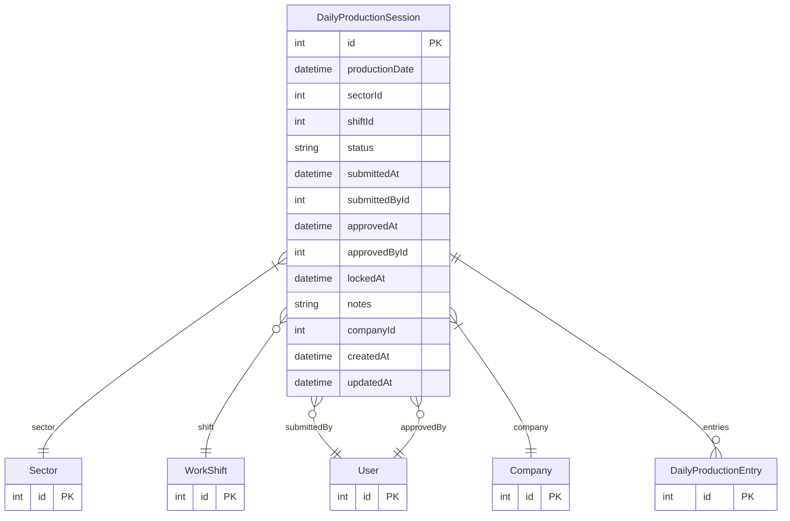

# DailyProductionSession

> Table name: `daily_production_sessions`

**Schema location:** Lines 14014-14040

## Fields

| Field | Type | Required | Unique | Default | Notes |
|-------|------|----------|--------|---------|-------|
| `id` | `Int` | ✅ | 🔑 PK | `autoincrement(` |  |
| `productionDate` | `DateTime` | ✅ |  | `` | DB: Date |
| `sectorId` | `Int` | ✅ |  | `` |  |
| `shiftId` | `Int?` | ❌ |  | `` |  |
| `status` | `String` | ✅ |  | `"DRAFT"` | DRAFT, SUBMITTED, APPROVED, LOCKED |
| `submittedAt` | `DateTime?` | ❌ |  | `` |  |
| `submittedById` | `Int?` | ❌ |  | `` |  |
| `approvedAt` | `DateTime?` | ❌ |  | `` |  |
| `approvedById` | `Int?` | ❌ |  | `` |  |
| `lockedAt` | `DateTime?` | ❌ |  | `` |  |
| `notes` | `String?` | ❌ |  | `` |  |
| `companyId` | `Int` | ✅ |  | `` |  |
| `createdAt` | `DateTime` | ✅ |  | `now(` |  |
| `updatedAt` | `DateTime` | ✅ |  | `` |  |

## Relations

| Field | Type | Cardinality | FK Fields | References | On Delete |
|-------|------|-------------|-----------|------------|-----------|
| `sector` | [Sector](./models/Sector.md) | Many-to-One | sectorId | id | - |
| `shift` | [WorkShift](./models/WorkShift.md) | Many-to-One (optional) | shiftId | id | - |
| `submittedBy` | [User](./models/User.md) | Many-to-One (optional) | submittedById | id | - |
| `approvedBy` | [User](./models/User.md) | Many-to-One (optional) | approvedById | id | - |
| `company` | [Company](./models/Company.md) | Many-to-One | companyId | id | Cascade |
| `entries` | [DailyProductionEntry](./models/DailyProductionEntry.md) | One-to-Many | - | - | - |

## Referenced By

| Model | Field | Cardinality |
|-------|-------|-------------|
| [Company](./models/Company.md) | `dailyProductionSessions` | Has many |
| [User](./models/User.md) | `dailySessionsSubmitted` | Has many |
| [User](./models/User.md) | `dailySessionsApproved` | Has many |
| [Sector](./models/Sector.md) | `dailyProductionSessions` | Has many |
| [WorkShift](./models/WorkShift.md) | `dailyProductionSessions` | Has many |
| [DailyProductionEntry](./models/DailyProductionEntry.md) | `session` | Has one |

## Indexes

- `companyId, sectorId, productionDate`

## Unique Constraints

- `companyId, sectorId, productionDate, shiftId`

## Entity Diagram

