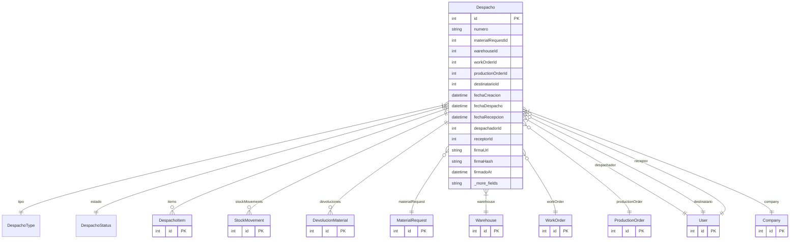

# Despacho

> Table name: `despachos`

**Schema location:** Lines 14694-14747

## Fields

| Field | Type | Required | Unique | Default | Notes |
|-------|------|----------|--------|---------|-------|
| `id` | `Int` | ✅ | 🔑 PK | `autoincrement(` |  |
| `numero` | `String` | ✅ |  | `` | DB: VarChar(50) |
| `materialRequestId` | `Int?` | ❌ |  | `` | Origen |
| `warehouseId` | `Int` | ✅ |  | `` |  |
| `workOrderId` | `Int?` | ❌ |  | `` | Destino (según tipo) |
| `productionOrderId` | `Int?` | ❌ |  | `` |  |
| `destinatarioId` | `Int?` | ❌ |  | `` |  |
| `fechaCreacion` | `DateTime` | ✅ |  | `now(` |  |
| `fechaDespacho` | `DateTime?` | ❌ |  | `` |  |
| `fechaRecepcion` | `DateTime?` | ❌ |  | `` |  |
| `despachadorId` | `Int` | ✅ |  | `` |  |
| `receptorId` | `Int?` | ❌ |  | `` |  |
| `firmaUrl` | `String?` | ❌ |  | `` | DB: VarChar(500). Firma como archivo (NO base64 en DB) |
| `firmaHash` | `String?` | ❌ |  | `` | DB: VarChar(64) |
| `firmadoAt` | `DateTime?` | ❌ |  | `` |  |
| `notas` | `String?` | ❌ |  | `` |  |
| `companyId` | `Int` | ✅ |  | `` |  |
| `createdAt` | `DateTime` | ✅ |  | `now(` |  |
| `updatedAt` | `DateTime` | ✅ |  | `` |  |

## Relations

| Field | Type | Cardinality | FK Fields | References | On Delete |
|-------|------|-------------|-----------|------------|-----------|
| `tipo` | [DespachoType](./models/DespachoType.md) | Many-to-One | - | - | - |
| `estado` | [DespachoStatus](./models/DespachoStatus.md) | Many-to-One | - | - | - |
| `items` | [DespachoItem](./models/DespachoItem.md) | One-to-Many | - | - | - |
| `stockMovements` | [StockMovement](./models/StockMovement.md) | One-to-Many | - | - | - |
| `devoluciones` | [DevolucionMaterial](./models/DevolucionMaterial.md) | One-to-Many | - | - | - |
| `materialRequest` | [MaterialRequest](./models/MaterialRequest.md) | Many-to-One (optional) | materialRequestId | id | - |
| `warehouse` | [Warehouse](./models/Warehouse.md) | Many-to-One | warehouseId | id | - |
| `workOrder` | [WorkOrder](./models/WorkOrder.md) | Many-to-One (optional) | workOrderId | id | - |
| `productionOrder` | [ProductionOrder](./models/ProductionOrder.md) | Many-to-One (optional) | productionOrderId | id | - |
| `despachador` | [User](./models/User.md) | Many-to-One | despachadorId | id | - |
| `destinatario` | [User](./models/User.md) | Many-to-One (optional) | destinatarioId | id | - |
| `receptor` | [User](./models/User.md) | Many-to-One (optional) | receptorId | id | - |
| `company` | [Company](./models/Company.md) | Many-to-One | companyId | id | Cascade |

## Referenced By

| Model | Field | Cardinality |
|-------|-------|-------------|
| [Company](./models/Company.md) | `despachos` | Has many |
| [User](./models/User.md) | `despachosDespachador` | Has many |
| [User](./models/User.md) | `despachosDestinatario` | Has many |
| [User](./models/User.md) | `despachosReceptor` | Has many |
| [WorkOrder](./models/WorkOrder.md) | `despachos` | Has many |
| [Warehouse](./models/Warehouse.md) | `despachos` | Has many |
| [StockMovement](./models/StockMovement.md) | `despacho` | Has one |
| [ProductionOrder](./models/ProductionOrder.md) | `despachos` | Has many |
| [MaterialRequest](./models/MaterialRequest.md) | `despachos` | Has many |
| [DespachoItem](./models/DespachoItem.md) | `despacho` | Has one |
| [DevolucionMaterial](./models/DevolucionMaterial.md) | `despachoOrigen` | Has one |

## Indexes

- `companyId, estado`
- `workOrderId`
- `productionOrderId`
- `fechaDespacho`
- `warehouseId`

## Unique Constraints

- `companyId, numero`

## Entity Diagram

