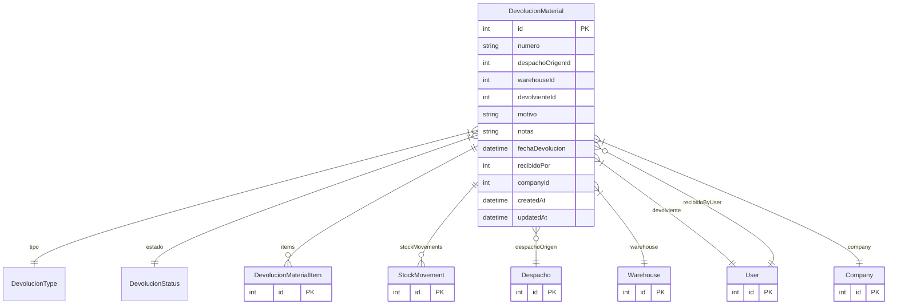

# DevolucionMaterial

> Table name: `devoluciones_material`

**Schema location:** Lines 14804-14841

## Fields

| Field | Type | Required | Unique | Default | Notes |
|-------|------|----------|--------|---------|-------|
| `id` | `Int` | ✅ | 🔑 PK | `autoincrement(` |  |
| `numero` | `String` | ✅ |  | `` | DB: VarChar(50) |
| `despachoOrigenId` | `Int?` | ❌ |  | `` | Referencia al despacho original (opcional) |
| `warehouseId` | `Int` | ✅ |  | `` | A qué depósito vuelve |
| `devolvienteId` | `Int` | ✅ |  | `` | Quien devuelve |
| `motivo` | `String` | ✅ |  | `` |  |
| `notas` | `String?` | ❌ |  | `` |  |
| `fechaDevolucion` | `DateTime?` | ❌ |  | `` |  |
| `recibidoPor` | `Int?` | ❌ |  | `` |  |
| `companyId` | `Int` | ✅ |  | `` |  |
| `createdAt` | `DateTime` | ✅ |  | `now(` |  |
| `updatedAt` | `DateTime` | ✅ |  | `` |  |

## Relations

| Field | Type | Cardinality | FK Fields | References | On Delete |
|-------|------|-------------|-----------|------------|-----------|
| `tipo` | [DevolucionType](./models/DevolucionType.md) | Many-to-One | - | - | - |
| `estado` | [DevolucionStatus](./models/DevolucionStatus.md) | Many-to-One | - | - | - |
| `items` | [DevolucionMaterialItem](./models/DevolucionMaterialItem.md) | One-to-Many | - | - | - |
| `stockMovements` | [StockMovement](./models/StockMovement.md) | One-to-Many | - | - | - |
| `despachoOrigen` | [Despacho](./models/Despacho.md) | Many-to-One (optional) | despachoOrigenId | id | - |
| `warehouse` | [Warehouse](./models/Warehouse.md) | Many-to-One | warehouseId | id | - |
| `devolviente` | [User](./models/User.md) | Many-to-One | devolvienteId | id | - |
| `recibidoByUser` | [User](./models/User.md) | Many-to-One (optional) | recibidoPor | id | - |
| `company` | [Company](./models/Company.md) | Many-to-One | companyId | id | Cascade |

## Referenced By

| Model | Field | Cardinality |
|-------|-------|-------------|
| [Company](./models/Company.md) | `devoluciones` | Has many |
| [User](./models/User.md) | `devolucionesDevolviente` | Has many |
| [User](./models/User.md) | `devolucionesRecibidas` | Has many |
| [Warehouse](./models/Warehouse.md) | `devoluciones` | Has many |
| [StockMovement](./models/StockMovement.md) | `devolucion` | Has one |
| [Despacho](./models/Despacho.md) | `devoluciones` | Has many |
| [DevolucionMaterialItem](./models/DevolucionMaterialItem.md) | `devolucion` | Has one |

## Indexes

- `companyId, estado`
- `despachoOrigenId`
- `warehouseId`

## Unique Constraints

- `companyId, numero`

## Entity Diagram

