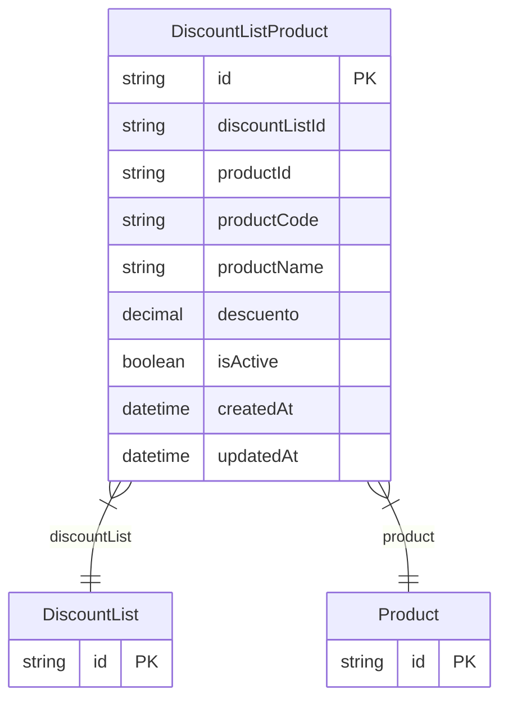

# DiscountListProduct

> Table name: `DiscountListProduct`

**Schema location:** Lines 4544-4563

## Fields

| Field | Type | Required | Unique | Default | Notes |
|-------|------|----------|--------|---------|-------|
| `id` | `String` | ✅ | 🔑 PK | `cuid(` |  |
| `discountListId` | `String` | ✅ |  | `` |  |
| `productId` | `String` | ✅ |  | `` | FK a Product |
| `productCode` | `String` | ✅ |  | `` | Código del producto (desnormalizado) |
| `productName` | `String` | ✅ |  | `` | Nombre del producto (desnormalizado) |
| `descuento` | `Decimal` | ✅ |  | `` | DB: Decimal(5, 2). Descuento (%) |
| `isActive` | `Boolean` | ✅ |  | `true` |  |
| `createdAt` | `DateTime` | ✅ |  | `now(` |  |
| `updatedAt` | `DateTime` | ✅ |  | `` |  |

## Relations

| Field | Type | Cardinality | FK Fields | References | On Delete |
|-------|------|-------------|-----------|------------|-----------|
| `discountList` | [DiscountList](./models/DiscountList.md) | Many-to-One | discountListId | id | Cascade |
| `product` | [Product](./models/Product.md) | Many-to-One | productId | id | Cascade |

## Referenced By

| Model | Field | Cardinality |
|-------|-------|-------------|
| [Product](./models/Product.md) | `discountListProducts` | Has many |
| [DiscountList](./models/DiscountList.md) | `productDiscounts` | Has many |

## Indexes

- `discountListId`
- `productId`

## Entity Diagram

