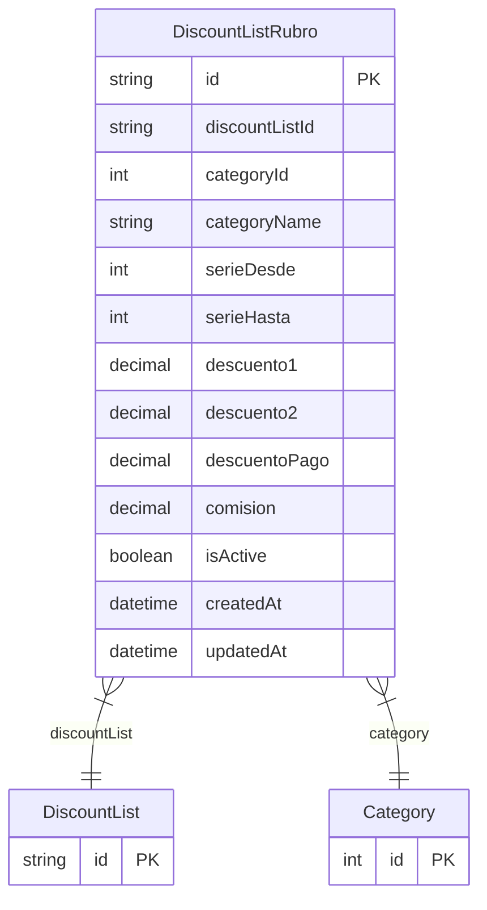

# DiscountListRubro

> Table name: `DiscountListRubro`

**Schema location:** Lines 4515-4541

## Fields

| Field | Type | Required | Unique | Default | Notes |
|-------|------|----------|--------|---------|-------|
| `id` | `String` | ✅ | 🔑 PK | `cuid(` |  |
| `discountListId` | `String` | ✅ |  | `` |  |
| `categoryId` | `Int` | ✅ |  | `` | FK a Category (rubro) |
| `categoryName` | `String` | ✅ |  | `` | Nombre del rubro (desnormalizado para visualización) |
| `serieDesde` | `Int?` | ❌ |  | `0` | Rangos de serie (opcional) |
| `serieHasta` | `Int?` | ❌ |  | `0` |  |
| `descuento1` | `Decimal?` | ❌ |  | `` | DB: Decimal(5, 2). Dto.1 (%) |
| `descuento2` | `Decimal?` | ❌ |  | `` | DB: Decimal(5, 2). Dto.2 (%) |
| `descuentoPago` | `Decimal?` | ❌ |  | `` | DB: Decimal(5, 2). Dto.Pago (%) |
| `comision` | `Decimal?` | ❌ |  | `` | DB: Decimal(5, 2). Comisión (%) |
| `isActive` | `Boolean` | ✅ |  | `true` |  |
| `createdAt` | `DateTime` | ✅ |  | `now(` |  |
| `updatedAt` | `DateTime` | ✅ |  | `` |  |

## Relations

| Field | Type | Cardinality | FK Fields | References | On Delete |
|-------|------|-------------|-----------|------------|-----------|
| `discountList` | [DiscountList](./models/DiscountList.md) | Many-to-One | discountListId | id | Cascade |
| `category` | [Category](./models/Category.md) | Many-to-One | categoryId | id | Cascade |

## Referenced By

| Model | Field | Cardinality |
|-------|-------|-------------|
| [Category](./models/Category.md) | `discountListRubros` | Has many |
| [DiscountList](./models/DiscountList.md) | `rubroDiscounts` | Has many |

## Indexes

- `discountListId`
- `categoryId`

## Entity Diagram

