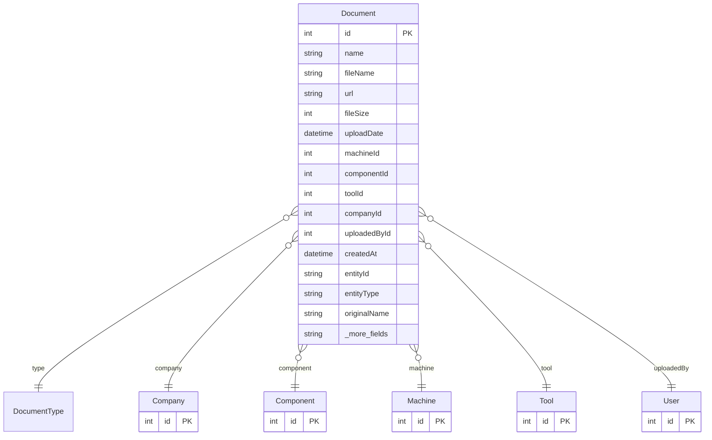

# Document

> Table name: `Document`

**Schema location:** Lines 2028-2059

## Fields

| Field | Type | Required | Unique | Default | Notes |
|-------|------|----------|--------|---------|-------|
| `id` | `Int` | ✅ | 🔑 PK | `autoincrement(` |  |
| `name` | `String?` | ❌ |  | `` |  |
| `fileName` | `String?` | ❌ |  | `` |  |
| `url` | `String` | ✅ |  | `` |  |
| `fileSize` | `Int?` | ❌ |  | `` |  |
| `uploadDate` | `DateTime` | ✅ |  | `now(` |  |
| `machineId` | `Int?` | ❌ |  | `` |  |
| `componentId` | `Int?` | ❌ |  | `` |  |
| `toolId` | `Int?` | ❌ |  | `` |  |
| `companyId` | `Int?` | ❌ |  | `` |  |
| `uploadedById` | `Int?` | ❌ |  | `` |  |
| `createdAt` | `DateTime` | ✅ |  | `now(` |  |
| `entityId` | `String?` | ❌ |  | `` |  |
| `entityType` | `String?` | ❌ |  | `` |  |
| `originalName` | `String?` | ❌ |  | `` |  |
| `updatedAt` | `DateTime` | ✅ |  | `now(` |  |
| `folder` | `String?` | ❌ |  | `` | Sistema de carpetas para organizar documentos |

## Relations

| Field | Type | Cardinality | FK Fields | References | On Delete |
|-------|------|-------------|-----------|------------|-----------|
| `type` | [DocumentType](./models/DocumentType.md) | Many-to-One (optional) | - | - | - |
| `company` | [Company](./models/Company.md) | Many-to-One (optional) | companyId | id | - |
| `component` | [Component](./models/Component.md) | Many-to-One (optional) | componentId | id | - |
| `machine` | [Machine](./models/Machine.md) | Many-to-One (optional) | machineId | id | - |
| `tool` | [Tool](./models/Tool.md) | Many-to-One (optional) | toolId | id | - |
| `uploadedBy` | [User](./models/User.md) | Many-to-One (optional) | uploadedById | id | - |

## Referenced By

| Model | Field | Cardinality |
|-------|-------|-------------|
| [Company](./models/Company.md) | `documents` | Has many |
| [User](./models/User.md) | `documents` | Has many |
| [Machine](./models/Machine.md) | `documents` | Has many |
| [Component](./models/Component.md) | `documents` | Has many |
| [Tool](./models/Tool.md) | `documents` | Has many |

## Indexes

- `entityType`
- `entityType, companyId`
- `companyId`
- `folder`

## Entity Diagram

