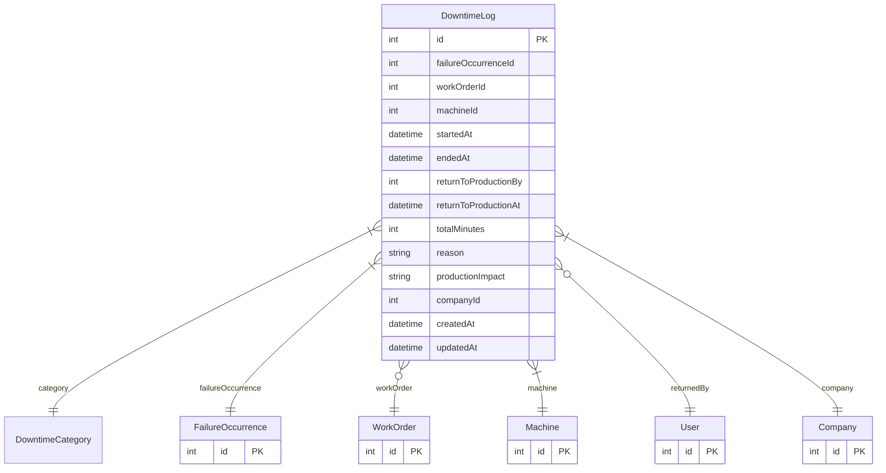

# DowntimeLog

> Table name: `downtime_logs`

**Schema location:** Lines 5553-5582

## Fields

| Field | Type | Required | Unique | Default | Notes |
|-------|------|----------|--------|---------|-------|
| `id` | `Int` | ✅ | 🔑 PK | `autoincrement(` |  |
| `failureOccurrenceId` | `Int` | ✅ |  | `` |  |
| `workOrderId` | `Int?` | ❌ |  | `` |  |
| `machineId` | `Int` | ✅ |  | `` |  |
| `startedAt` | `DateTime` | ✅ |  | `now(` |  |
| `endedAt` | `DateTime?` | ❌ |  | `` | null = aún en downtime |
| `returnToProductionBy` | `Int?` | ❌ |  | `` |  |
| `returnToProductionAt` | `DateTime?` | ❌ |  | `` |  |
| `totalMinutes` | `Int?` | ❌ |  | `` |  |
| `reason` | `String?` | ❌ |  | `` |  |
| `productionImpact` | `String?` | ❌ |  | `` |  |
| `companyId` | `Int` | ✅ |  | `` |  |
| `createdAt` | `DateTime` | ✅ |  | `now(` |  |
| `updatedAt` | `DateTime` | ✅ |  | `` |  |

## Relations

| Field | Type | Cardinality | FK Fields | References | On Delete |
|-------|------|-------------|-----------|------------|-----------|
| `category` | [DowntimeCategory](./models/DowntimeCategory.md) | Many-to-One | - | - | - |
| `failureOccurrence` | [FailureOccurrence](./models/FailureOccurrence.md) | Many-to-One | failureOccurrenceId | id | Cascade |
| `workOrder` | [WorkOrder](./models/WorkOrder.md) | Many-to-One (optional) | workOrderId | id | SetNull |
| `machine` | [Machine](./models/Machine.md) | Many-to-One | machineId | id | Cascade |
| `returnedBy` | [User](./models/User.md) | Many-to-One (optional) | returnToProductionBy | id | - |
| `company` | [Company](./models/Company.md) | Many-to-One | companyId | id | Cascade |

## Referenced By

| Model | Field | Cardinality |
|-------|-------|-------------|
| [Company](./models/Company.md) | `downtimeLogs` | Has many |
| [User](./models/User.md) | `downtimeReturned` | Has many |
| [Machine](./models/Machine.md) | `downtimeLogs` | Has many |
| [WorkOrder](./models/WorkOrder.md) | `downtimeLogs` | Has many |
| [FailureOccurrence](./models/FailureOccurrence.md) | `downtimeLogs` | Has many |

## Indexes

- `failureOccurrenceId`
- `machineId, startedAt`
- `companyId, machineId, startedAt`
- `workOrderId, endedAt`
- `companyId, endedAt, startedAt`

## Entity Diagram

