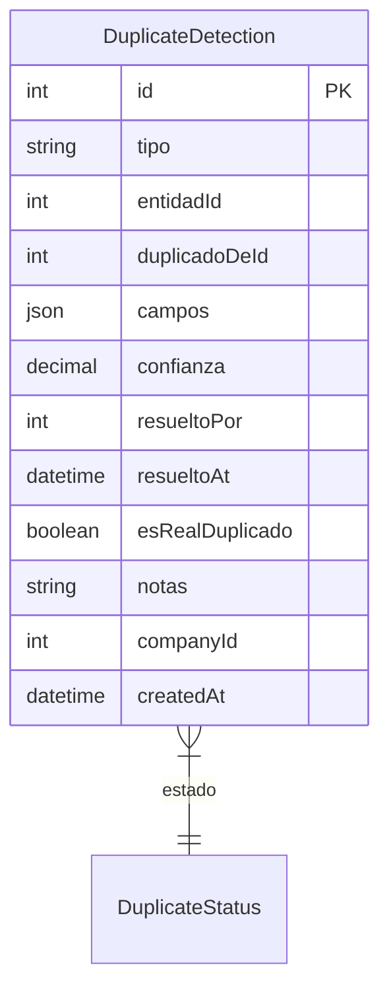

# DuplicateDetection

> Table name: `duplicate_detections`

**Schema location:** Lines 7668-7688

## Fields

| Field | Type | Required | Unique | Default | Notes |
|-------|------|----------|--------|---------|-------|
| `id` | `Int` | ✅ | 🔑 PK | `autoincrement(` |  |
| `tipo` | `String` | ✅ |  | `` | DB: VarChar(50). factura, item_factura, recepcion_factura |
| `entidadId` | `Int` | ✅ |  | `` | ID del documento sospechoso |
| `duplicadoDeId` | `Int?` | ❌ |  | `` | ID del documento original |
| `campos` | `Json` | ✅ |  | `` | Campos que coinciden |
| `confianza` | `Decimal` | ✅ |  | `` | DB: Decimal(5, 2). % de probabilidad de ser duplicado |
| `resueltoPor` | `Int?` | ❌ |  | `` |  |
| `resueltoAt` | `DateTime?` | ❌ |  | `` |  |
| `esRealDuplicado` | `Boolean?` | ❌ |  | `` |  |
| `notas` | `String?` | ❌ |  | `` |  |
| `companyId` | `Int` | ✅ |  | `` |  |
| `createdAt` | `DateTime` | ✅ |  | `now(` |  |

## Relations

| Field | Type | Cardinality | FK Fields | References | On Delete |
|-------|------|-------------|-----------|------------|-----------|
| `estado` | [DuplicateStatus](./models/DuplicateStatus.md) | Many-to-One | - | - | - |

## Indexes

- `companyId`
- `tipo`
- `estado`
- `entidadId`

## Entity Diagram

