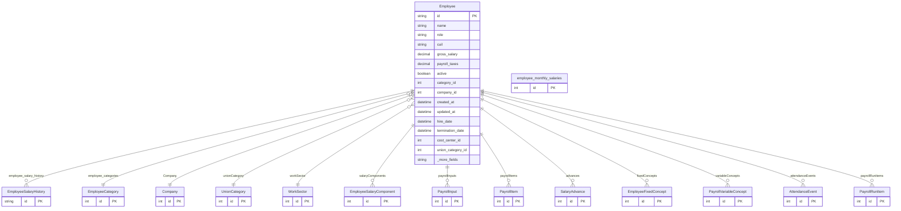

# Employee

> Table name: `employees`

**Schema location:** Lines 3247-3296

## Fields

| Field | Type | Required | Unique | Default | Notes |
|-------|------|----------|--------|---------|-------|
| `id` | `String` | ✅ | 🔑 PK | `dbgenerated("(gen_random_uuid(` | DB: VarChar(255) |
| `name` | `String` | ✅ |  | `` | DB: VarChar(255) |
| `role` | `String` | ✅ |  | `` | DB: VarChar(255) |
| `cuil` | `String?` | ❌ |  | `` | DB: VarChar(20). CUIL argentino (XX-XXXXXXXX-X) |
| `gross_salary` | `Decimal` | ✅ |  | `` | DB: Decimal(10, 2) |
| `payroll_taxes` | `Decimal?` | ❌ |  | `0` | DB: Decimal(10, 2) |
| `active` | `Boolean` | ✅ |  | `true` |  |
| `category_id` | `Int?` | ❌ |  | `` | Legacy (deprecated) |
| `company_id` | `Int` | ✅ |  | `` |  |
| `created_at` | `DateTime?` | ❌ |  | `now(` | DB: Timestamptz(6) |
| `updated_at` | `DateTime?` | ❌ |  | `now(` | DB: Timestamptz(6) |
| `hire_date` | `DateTime?` | ❌ |  | `` | DB: Date. Campos para Nóminas |
| `termination_date` | `DateTime?` | ❌ |  | `` | DB: Date |
| `cost_center_id` | `Int?` | ❌ |  | `` |  |
| `union_category_id` | `Int?` | ❌ |  | `` | Categoría dentro del gremio (OFICIAL, AYUDANTE, etc.) |
| `work_sector_id` | `Int?` | ❌ |  | `` | Sector de trabajo (Albañilería, Oficina, etc.) |
| `employee_monthly_salaries` | `employee_monthly_salaries[]` | ✅ |  | `` |  |

## Relations

| Field | Type | Cardinality | FK Fields | References | On Delete |
|-------|------|-------------|-----------|------------|-----------|
| `employee_salary_history` | [EmployeeSalaryHistory](./models/EmployeeSalaryHistory.md) | One-to-Many | - | - | - |
| `employee_categories` | [EmployeeCategory](./models/EmployeeCategory.md) | Many-to-One (optional) | category_id | id | - |
| `Company` | [Company](./models/Company.md) | Many-to-One | company_id | id | Cascade |
| `unionCategory` | [UnionCategory](./models/UnionCategory.md) | Many-to-One (optional) | union_category_id | id | - |
| `workSector` | [WorkSector](./models/WorkSector.md) | Many-to-One (optional) | work_sector_id | id | - |
| `salaryComponents` | [EmployeeSalaryComponent](./models/EmployeeSalaryComponent.md) | One-to-Many | - | - | - |
| `payrollInputs` | [PayrollInput](./models/PayrollInput.md) | One-to-Many | - | - | - |
| `payrollItems` | [PayrollItem](./models/PayrollItem.md) | One-to-Many | - | - | - |
| `advances` | [SalaryAdvance](./models/SalaryAdvance.md) | One-to-Many | - | - | - |
| `fixedConcepts` | [EmployeeFixedConcept](./models/EmployeeFixedConcept.md) | One-to-Many | - | - | - |
| `variableConcepts` | [PayrollVariableConcept](./models/PayrollVariableConcept.md) | One-to-Many | - | - | - |
| `attendanceEvents` | [AttendanceEvent](./models/AttendanceEvent.md) | One-to-Many | - | - | - |
| `payrollRunItems` | [PayrollRunItem](./models/PayrollRunItem.md) | One-to-Many | - | - | - |

## Referenced By

| Model | Field | Cardinality |
|-------|-------|-------------|
| [Company](./models/Company.md) | `employees` | Has many |
| [EmployeeCategory](./models/EmployeeCategory.md) | `employees` | Has many |
| [EmployeeSalaryHistory](./models/EmployeeSalaryHistory.md) | `employees` | Has one |
| [employee_monthly_salaries](./models/employee_monthly_salaries.md) | `employees` | Has one |
| [EmployeeSalaryComponent](./models/EmployeeSalaryComponent.md) | `employee` | Has one |
| [PayrollInput](./models/PayrollInput.md) | `employee` | Has one |
| [PayrollItem](./models/PayrollItem.md) | `employee` | Has one |
| [SalaryAdvance](./models/SalaryAdvance.md) | `employee` | Has one |
| [UnionCategory](./models/UnionCategory.md) | `employees` | Has many |
| [WorkSector](./models/WorkSector.md) | `employees` | Has many |
| [EmployeeFixedConcept](./models/EmployeeFixedConcept.md) | `employee` | Has one |
| [PayrollVariableConcept](./models/PayrollVariableConcept.md) | `employee` | Has one |
| [AttendanceEvent](./models/AttendanceEvent.md) | `employee` | Has one |
| [PayrollRunItem](./models/PayrollRunItem.md) | `employee` | Has one |

## Indexes

- `category_id`
- `company_id`
- `cost_center_id`
- `union_category_id`
- `work_sector_id`

## Entity Diagram

