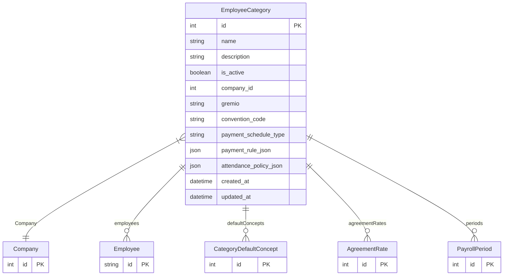

# EmployeeCategory

> Table name: `employee_categories`

**Schema location:** Lines 3215-3245

## Fields

| Field | Type | Required | Unique | Default | Notes |
|-------|------|----------|--------|---------|-------|
| `id` | `Int` | ✅ | 🔑 PK | `autoincrement(` |  |
| `name` | `String` | ✅ |  | `` | DB: VarChar(255) |
| `description` | `String?` | ❌ |  | `` |  |
| `is_active` | `Boolean` | ✅ |  | `true` |  |
| `company_id` | `Int` | ✅ |  | `` |  |
| `gremio` | `String?` | ❌ |  | `` | DB: VarChar(100). Gremio/Convenio |
| `convention_code` | `String?` | ❌ |  | `` | DB: VarChar(50) |
| `payment_schedule_type` | `String` | ✅ |  | `"BIWEEKLY_FIXED"` | DB: VarChar(50). Regla de pago FLEXIBLE |
| `payment_rule_json` | `Json?` | ❌ |  | `` | BIWEEKLY_FIXED | BIWEEKLY_1_15_16_EOM | MONTHLY_SAME_MONTH | MONTHLY_NEXT_MONTH |
| `attendance_policy_json` | `Json?` | ❌ |  | `` | Política de asistencia |
| `created_at` | `DateTime?` | ❌ |  | `now(` | DB: Timestamptz(6) |
| `updated_at` | `DateTime?` | ❌ |  | `now(` | DB: Timestamptz(6) |

## Relations

| Field | Type | Cardinality | FK Fields | References | On Delete |
|-------|------|-------------|-----------|------------|-----------|
| `Company` | [Company](./models/Company.md) | Many-to-One | company_id | id | Cascade |
| `employees` | [Employee](./models/Employee.md) | One-to-Many | - | - | - |
| `defaultConcepts` | [CategoryDefaultConcept](./models/CategoryDefaultConcept.md) | One-to-Many | - | - | - |
| `agreementRates` | [AgreementRate](./models/AgreementRate.md) | One-to-Many | - | - | - |
| `periods` | [PayrollPeriod](./models/PayrollPeriod.md) | One-to-Many | - | - | - |

## Referenced By

| Model | Field | Cardinality |
|-------|-------|-------------|
| [Company](./models/Company.md) | `employee_categories` | Has many |
| [Employee](./models/Employee.md) | `employee_categories` | Has one |
| [PayrollPeriod](./models/PayrollPeriod.md) | `category` | Has one |
| [AgreementRate](./models/AgreementRate.md) | `category` | Has one |
| [CategoryDefaultConcept](./models/CategoryDefaultConcept.md) | `category` | Has one |

## Indexes

- `company_id`

## Entity Diagram

