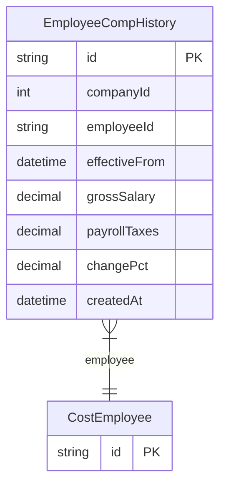

# EmployeeCompHistory

> Table name: `EmployeeCompHistory`

**Schema location:** Lines 2703-2716

## Fields

| Field | Type | Required | Unique | Default | Notes |
|-------|------|----------|--------|---------|-------|
| `id` | `String` | ✅ | 🔑 PK | `uuid(` |  |
| `companyId` | `Int` | ✅ |  | `` |  |
| `employeeId` | `String` | ✅ |  | `` |  |
| `effectiveFrom` | `DateTime` | ✅ |  | `` |  |
| `grossSalary` | `Decimal` | ✅ |  | `` | DB: Decimal(12, 2) |
| `payrollTaxes` | `Decimal` | ✅ |  | `` | DB: Decimal(12, 2) |
| `changePct` | `Decimal?` | ❌ |  | `` | DB: Decimal(5, 2) |
| `createdAt` | `DateTime` | ✅ |  | `now(` |  |

## Relations

| Field | Type | Cardinality | FK Fields | References | On Delete |
|-------|------|-------------|-----------|------------|-----------|
| `employee` | [CostEmployee](./models/CostEmployee.md) | Many-to-One | employeeId | id | Cascade |

## Referenced By

| Model | Field | Cardinality |
|-------|-------|-------------|
| [CostEmployee](./models/CostEmployee.md) | `compHistory` | Has many |

## Indexes

- `employeeId, effectiveFrom`

## Entity Diagram

