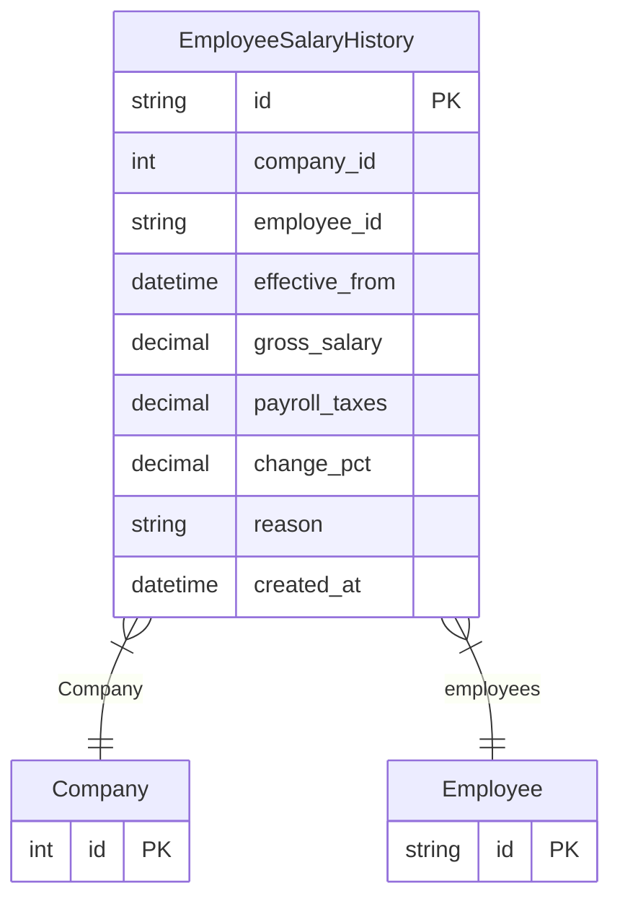

# EmployeeSalaryHistory

> Table name: `employee_salary_history`

**Schema location:** Lines 3298-3314

## Fields

| Field | Type | Required | Unique | Default | Notes |
|-------|------|----------|--------|---------|-------|
| `id` | `String` | ✅ | 🔑 PK | `dbgenerated("(gen_random_uuid(` | DB: VarChar(255) |
| `company_id` | `Int` | ✅ |  | `` |  |
| `employee_id` | `String` | ✅ |  | `` | DB: VarChar(255) |
| `effective_from` | `DateTime?` | ❌ |  | `now(` | DB: Timestamptz(6) |
| `gross_salary` | `Decimal` | ✅ |  | `` | DB: Decimal(10, 2) |
| `payroll_taxes` | `Decimal?` | ❌ |  | `0` | DB: Decimal(10, 2) |
| `change_pct` | `Decimal?` | ❌ |  | `` | DB: Decimal(5, 2) |
| `reason` | `String?` | ❌ |  | `` |  |
| `created_at` | `DateTime?` | ❌ |  | `now(` | DB: Timestamptz(6) |

## Relations

| Field | Type | Cardinality | FK Fields | References | On Delete |
|-------|------|-------------|-----------|------------|-----------|
| `Company` | [Company](./models/Company.md) | Many-to-One | company_id | id | Cascade |
| `employees` | [Employee](./models/Employee.md) | Many-to-One | employee_id | id | Cascade |

## Referenced By

| Model | Field | Cardinality |
|-------|-------|-------------|
| [Company](./models/Company.md) | `employee_salary_history` | Has many |
| [Employee](./models/Employee.md) | `employee_salary_history` | Has many |

## Indexes

- `company_id`
- `employee_id`

## Entity Diagram

