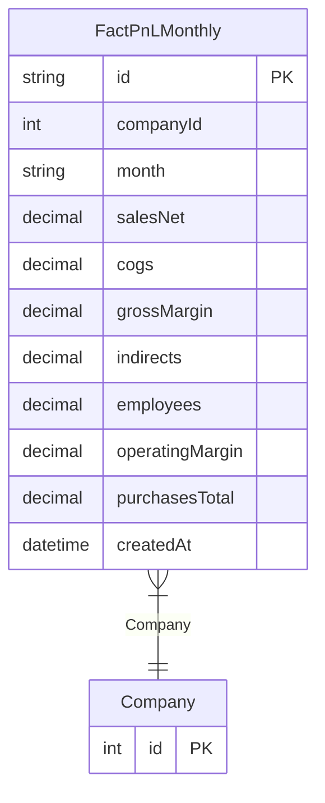

# FactPnLMonthly

**Schema location:** Lines 2955-2970

## Fields

| Field | Type | Required | Unique | Default | Notes |
|-------|------|----------|--------|---------|-------|
| `id` | `String` | ✅ | 🔑 PK | `` |  |
| `companyId` | `Int` | ✅ |  | `` |  |
| `month` | `String` | ✅ |  | `` |  |
| `salesNet` | `Decimal` | ✅ |  | `` | DB: Decimal(15, 4) |
| `cogs` | `Decimal` | ✅ |  | `` | DB: Decimal(15, 4) |
| `grossMargin` | `Decimal` | ✅ |  | `` | DB: Decimal(15, 4) |
| `indirects` | `Decimal` | ✅ |  | `` | DB: Decimal(15, 4) |
| `employees` | `Decimal` | ✅ |  | `` | DB: Decimal(15, 4) |
| `operatingMargin` | `Decimal` | ✅ |  | `` | DB: Decimal(15, 4) |
| `purchasesTotal` | `Decimal` | ✅ |  | `` | DB: Decimal(15, 4) |
| `createdAt` | `DateTime` | ✅ |  | `now(` |  |

## Relations

| Field | Type | Cardinality | FK Fields | References | On Delete |
|-------|------|-------------|-----------|------------|-----------|
| `Company` | [Company](./models/Company.md) | Many-to-One | companyId | id | Cascade |

## Referenced By

| Model | Field | Cardinality |
|-------|-------|-------------|
| [Company](./models/Company.md) | `FactPnLMonthly` | Has many |

## Unique Constraints

- `companyId, month`

## Entity Diagram

