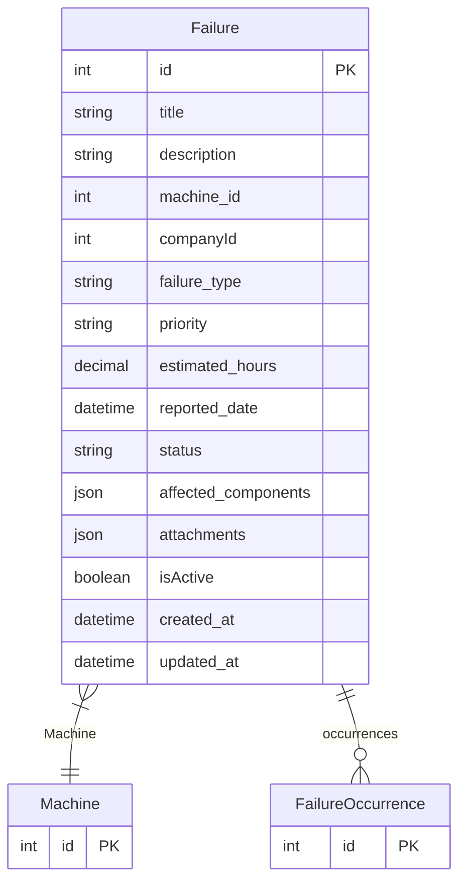

# Failure

> Table name: `failures`

**Schema location:** Lines 1691-1715

## Fields

| Field | Type | Required | Unique | Default | Notes |
|-------|------|----------|--------|---------|-------|
| `id` | `Int` | ✅ | 🔑 PK | `autoincrement(` |  |
| `title` | `String` | ✅ |  | `` | DB: VarChar(255) |
| `description` | `String?` | ❌ |  | `` |  |
| `machine_id` | `Int` | ✅ |  | `` |  |
| `companyId` | `Int?` | ❌ |  | `` | Empresa a la que pertenece |
| `failure_type` | `String?` | ❌ |  | `"MECANICA"` | DB: VarChar(50) |
| `priority` | `String?` | ❌ |  | `"MEDIUM"` | DB: VarChar(20) |
| `estimated_hours` | `Decimal?` | ❌ |  | `0` | DB: Decimal(5, 2) |
| `reported_date` | `DateTime?` | ❌ |  | `now(` | DB: Timestamp(6) |
| `status` | `String?` | ❌ |  | `"REPORTED"` | DB: VarChar(50) |
| `affected_components` | `Json?` | ❌ |  | `` |  |
| `attachments` | `Json?` | ❌ |  | `` |  |
| `isActive` | `Boolean` | ✅ |  | `true` |  |
| `created_at` | `DateTime?` | ❌ |  | `now(` | DB: Timestamp(6) |
| `updated_at` | `DateTime?` | ❌ |  | `now(` | DB: Timestamp(6) |

## Relations

| Field | Type | Cardinality | FK Fields | References | On Delete |
|-------|------|-------------|-----------|------------|-----------|
| `Machine` | [Machine](./models/Machine.md) | Many-to-One | machine_id | id | Cascade |
| `occurrences` | [FailureOccurrence](./models/FailureOccurrence.md) | One-to-Many | - | - | - |

## Referenced By

| Model | Field | Cardinality |
|-------|-------|-------------|
| [Machine](./models/Machine.md) | `failures` | Has many |
| [FailureOccurrence](./models/FailureOccurrence.md) | `failureType` | Has one |

## Indexes

- `machine_id`
- `reported_date`
- `status`
- `companyId`

## Entity Diagram

