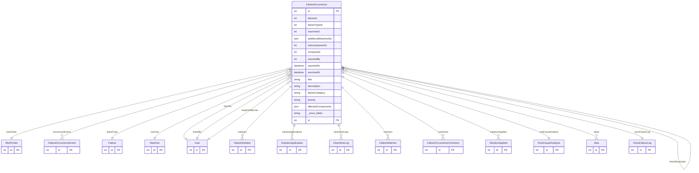

# FailureOccurrence

> Table name: `failure_occurrences`

**Schema location:** Lines 1718-1806

## Fields

| Field | Type | Required | Unique | Default | Notes |
|-------|------|----------|--------|---------|-------|
| `id` | `Int` | ✅ | 🔑 PK | `autoincrement(` |  |
| `failureId` | `Int?` | ❌ |  | `` | WorkOrder asociado (OPCIONAL para observaciones) |
| `failureTypeId` | `Int?` | ❌ |  | `` | Link al catálogo de tipos de falla (opcional) |
| `machineId` | `Int?` | ❌ |  | `` | Máquina afectada principal (opcional para datos legacy) |
| `additionalMachineIds` | `Json?` | ❌ |  | `` | IDs de máquinas adicionales afectadas [1, 2, 3] |
| `subcomponentId` | `Int?` | ❌ |  | `` | Subcomponente específico (para performance indexes) |
| `companyId` | `Int` | ✅ |  | `` | Empresa (denormalizado para performance) |
| `reportedBy` | `Int` | ✅ |  | `` | Usuario que reportó |
| `reportedAt` | `DateTime` | ✅ |  | `now(` |  |
| `resolvedAt` | `DateTime?` | ❌ |  | `` | Fecha de resolución |
| `title` | `String?` | ❌ |  | `` | Título de la falla (puede sobrescribir del tipo) |
| `description` | `String?` | ❌ |  | `` | Descripción específica de esta ocurrencia |
| `failureCategory` | `String?` | ❌ |  | `"MECANICA"` | DB: VarChar(50) |
| `priority` | `String?` | ❌ |  | `"MEDIUM"` | DB: VarChar(20) |
| `affectedComponents` | `Json?` | ❌ |  | `` | IDs de componentes afectados |
| `status` | `String?` | ❌ |  | `"OPEN"` | DB: VarChar(20). OPEN, IN_PROGRESS, RESOLVED |
| `notes` | `String?` | ❌ |  | `` |  |
| `isIntermittent` | `Boolean` | ✅ |  | `false` | NUEVOS CAMPOS - Sistema Correctivo Profesional |
| `isObservation` | `Boolean` | ✅ |  | `false` |  |
| `causedDowntime` | `Boolean` | ✅ |  | `false` |  |
| `linkedToOccurrenceId` | `Int?` | ❌ |  | `` | Vinculado a ocurrencia principal |
| `linkedAt` | `DateTime?` | ❌ |  | `` |  |
| `linkedById` | `Int?` | ❌ |  | `` | Usuario que vinculó |
| `linkedReason` | `String?` | ❌ |  | `` | DB: VarChar(255) |
| `isLinkedDuplicate` | `Boolean` | ✅ |  | `false` |  |
| `reopenedFrom` | `Int?` | ❌ |  | `` | Reapertura |
| `reopenReason` | `String?` | ❌ |  | `` |  |
| `reopenedAt` | `DateTime?` | ❌ |  | `` |  |
| `reopenedById` | `Int?` | ❌ |  | `` |  |
| `resolvedImmediately` | `Boolean` | ✅ |  | `false` | Resolución inmediata |
| `symptoms` | `Json?` | ❌ |  | `` | Array de symptom IDs |
| `photos` | `Json?` | ❌ |  | `` | Array de URLs de fotos [{url, fileName, originalName}] |

## Relations

| Field | Type | Cardinality | FK Fields | References | On Delete |
|-------|------|-------------|-----------|------------|-----------|
| `workOrder` | [WorkOrder](./models/WorkOrder.md) | Many-to-One (optional) | failureId | id | Cascade |
| `occurrenceEvents` | [FailureOccurrenceEvent](./models/FailureOccurrenceEvent.md) | One-to-Many | - | - | - |
| `failureType` | [Failure](./models/Failure.md) | Many-to-One (optional) | failureTypeId | id | SetNull |
| `machine` | [Machine](./models/Machine.md) | Many-to-One (optional) | machineId | id | Cascade |
| `reporter` | [User](./models/User.md) | Many-to-One | reportedBy | id | - |
| `solutions` | [FailureSolution](./models/FailureSolution.md) | One-to-Many | - | - | - |
| `solutionApplications` | [SolutionApplication](./models/SolutionApplication.md) | One-to-Many | - | - | - |
| `downtimeLogs` | [DowntimeLog](./models/DowntimeLog.md) | One-to-Many | - | - | - |
| `watchers` | [FailureWatcher](./models/FailureWatcher.md) | One-to-Many | - | - | - |
| `comments` | [FailureOccurrenceComment](./models/FailureOccurrenceComment.md) | One-to-Many | - | - | - |
| `solutionsApplied` | [SolutionApplied](./models/SolutionApplied.md) | One-to-Many | - | - | - |
| `rootCauseAnalysis` | [RootCauseAnalysis](./models/RootCauseAnalysis.md) | Many-to-One (optional) | - | - | - |
| `linkedOccurrence` | [FailureOccurrence](./models/FailureOccurrence.md) | Many-to-One (optional) | linkedToOccurrenceId | id | - |
| `linkedDuplicates` | [FailureOccurrence](./models/FailureOccurrence.md) | One-to-Many | - | - | - |
| `linkedBy` | [User](./models/User.md) | Many-to-One (optional) | linkedById | id | - |
| `reopenedByUser` | [User](./models/User.md) | Many-to-One (optional) | reopenedById | id | - |
| `ideas` | [Idea](./models/Idea.md) | One-to-Many | - | - | - |
| `voiceFailureLog` | [VoiceFailureLog](./models/VoiceFailureLog.md) | Many-to-One (optional) | - | - | - |

## Referenced By

| Model | Field | Cardinality |
|-------|-------|-------------|
| [User](./models/User.md) | `failureOccurrences` | Has many |
| [User](./models/User.md) | `occurrencesLinked` | Has many |
| [User](./models/User.md) | `occurrencesReopened` | Has many |
| [Machine](./models/Machine.md) | `failureOccurrences` | Has many |
| [WorkOrder](./models/WorkOrder.md) | `failureOccurrences` | Has many |
| [Failure](./models/Failure.md) | `occurrences` | Has many |
| [FailureSolution](./models/FailureSolution.md) | `occurrence` | Has one |
| [SolutionApplication](./models/SolutionApplication.md) | `occurrence` | Has one |
| [DowntimeLog](./models/DowntimeLog.md) | `failureOccurrence` | Has one |
| [FailureWatcher](./models/FailureWatcher.md) | `failureOccurrence` | Has one |
| [FailureOccurrenceComment](./models/FailureOccurrenceComment.md) | `failureOccurrence` | Has one |
| [SolutionApplied](./models/SolutionApplied.md) | `failureOccurrence` | Has one |
| [FailureOccurrenceEvent](./models/FailureOccurrenceEvent.md) | `failureOccurrence` | Has one |
| [RootCauseAnalysis](./models/RootCauseAnalysis.md) | `failureOccurrence` | Has one |
| [Idea](./models/Idea.md) | `failureOccurrence` | Has one |
| [VoiceFailureLog](./models/VoiceFailureLog.md) | `failureOccurrence` | Has one |

## Indexes

- `failureId`
- `failureTypeId`
- `machineId`
- `status`
- `reportedAt`
- `linkedToOccurrenceId`
- `isLinkedDuplicate`
- `isIntermittent`
- `causedDowntime`
- `companyId, status, reportedAt`
- `companyId, machineId, status`
- `companyId, machineId, subcomponentId, reportedAt`
- `companyId, isLinkedDuplicate, status`
- `companyId, isLinkedDuplicate, priority, status`
- `companyId, reopenedFrom`

## Entity Diagram

